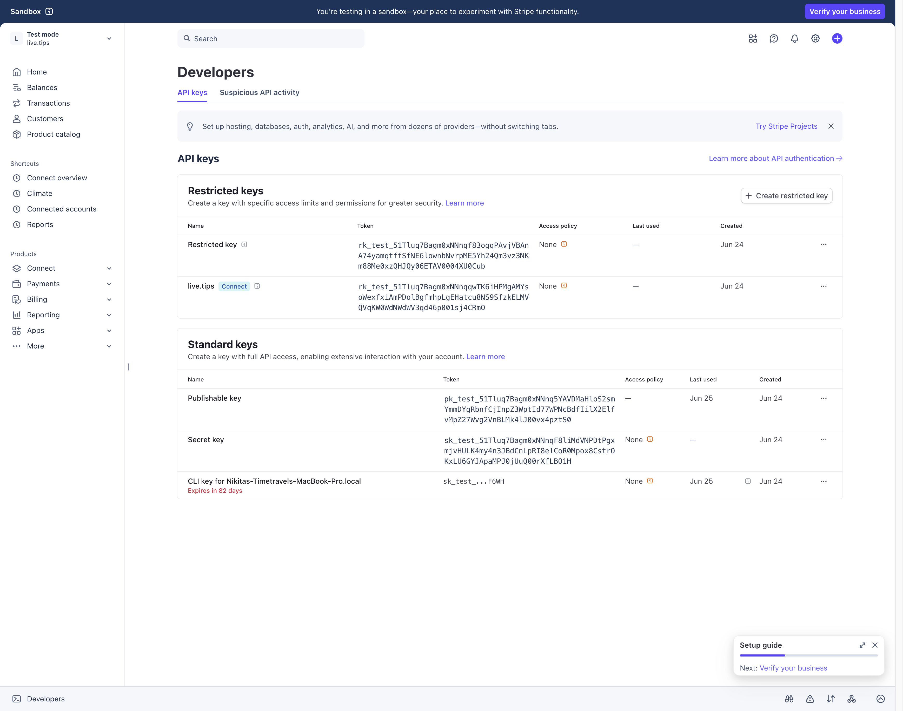
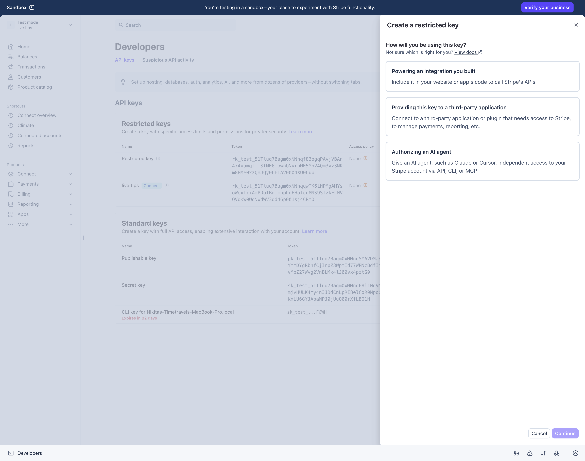
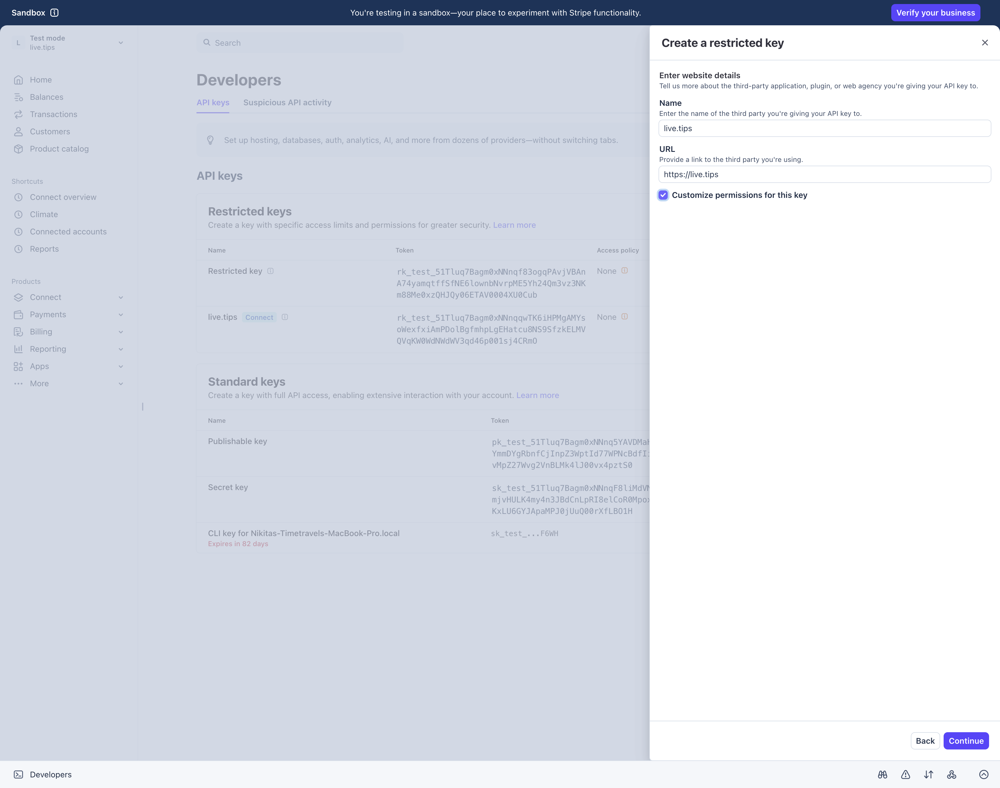
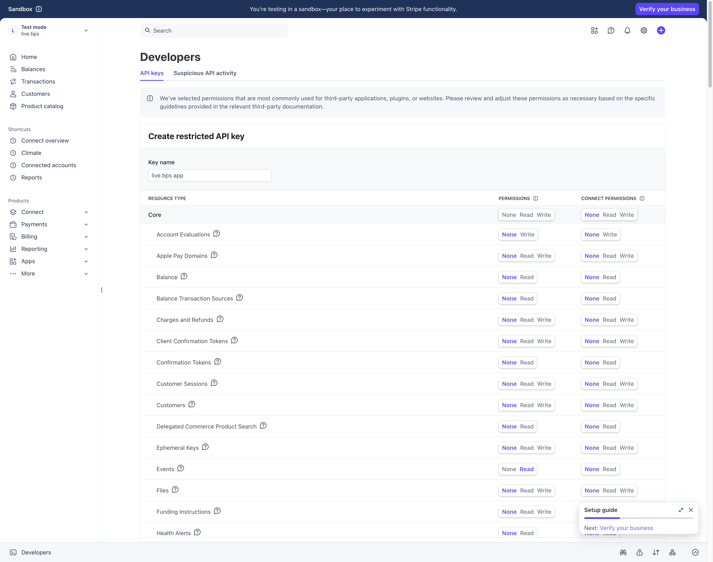

# Connect your Stripe account to live.tips

live.tips talks to Stripe **as you** — there is no middleman server. To make that
possible you create a *restricted API key* in your own Stripe dashboard and paste
it into the app. The key can only do the six things the app needs, nothing else:
it cannot move money, issue refunds, see your balance, or touch payouts.

It takes about two minutes, once.

> **Tip — the fast path:** on the app's *Connect Stripe* screen, tap
> **“Create the key (pre-filled) in Stripe”** (or scan the QR with your laptop).
> It opens the form from step 4 with the key name and all six permissions
> already selected — you just review and click **Create key**. The steps below
> are the manual path, and useful to understand what you're granting.

## Before you start

- You need a Stripe account that can receive payments
  ([stripe.com](https://stripe.com), free to create; Stripe's standard
  processing fees apply to tips).
- Use a laptop/desktop browser if you can — the dashboard is easier there. The
  app shows a QR code that opens the right page on another device.
- To rehearse without real money first, do everything below inside a Stripe
  **sandbox** (test mode) instead — see [Test mode](#test-mode-rehearsal) at the
  end.

## Step 1 — Open the API keys page

Sign in at [dashboard.stripe.com](https://dashboard.stripe.com) and open
[dashboard.stripe.com/apikeys](https://dashboard.stripe.com/apikeys)
(or click **Developers** in the bottom-left corner → **API keys**).

## Step 2 — Create a restricted key

Click **Create restricted key**. Stripe asks how you'll use it — choose
**“Providing this key to a third-party application”** (live.tips is the
third-party application).

## Step 3 — Name it and customize permissions

- **Name:** `live.tips`
- **URL:** `https://live.tips`
- Tick **“Customize permissions for this key”** — the default third-party
  template grants far more than this app needs, and we want the minimum.

## Step 4 — Grant exactly six permissions

In the permissions table, set these six rows — and leave **everything else on
“None”** (also leave the whole *Connect permissions* column on “None”):

| Resource | Permission | Why the app needs it |
| --- | --- | --- |
| **Checkout Sessions** | Read | See incoming tips (history & details) |
| **Events** | Read | Live feed — poll for new tips during a session |
| **Charges** | Read | See in-person tips you tap on a card reader or phone |
| **Payment Links** | Write | Create your tip link |
| **Products** | Write | Create the "Tips" product behind the link |
| **Prices** | Write | Create the pay-what-you-want price |

> Rows are grouped by product area — *Checkout Sessions* and *Payment Links*
> have their own sections further down the page; *Prices* is under the Billing
> group. The search box in your browser (Cmd/Ctrl-F) finds them quickly.

**All three reads are read-only, and there is no fourth kind.** *Charges: Read*
lets the app *see* payments; it cannot create one, refund one, or move a cent.
Leave *Charges* on **Read** — never Write. Least privilege is the whole point of
this key.

Click **Create key** at the bottom.

## Step 5 — Copy the key into the app

Back on the API keys page, find your new **live.tips** key in the *Restricted
keys* list and use **Click to copy**. The key starts with `rk_live_…`.

Getting it from laptop to phone/tablet safely: AirDrop, a password manager, or
a synced clipboard (Universal Clipboard on Apple devices) all work. Avoid
email/chat.

In the app: **Connect your Stripe account → paste → Verify & connect.** The app
checks every permission and tells you exactly which one is missing if the key
was created differently.

## What the app does with the key

- Stored only in this device's keychain/keystore. It never leaves the device
  except in requests to `api.stripe.com` over TLS.
- On first run the app creates in your account: a product ("Tips — <your
  name>"), a pay-what-you-want price, and a payment link — all tagged
  `managed_by: live.tips` so you can recognize them in the dashboard.
- You can revoke the key in the dashboard at any time; the app simply stops
  working until you connect a new one. Revoking does not affect your money or
  your Stripe account.

## Tips you tap in person

Not everyone will scan the QR. Someone walks up with a card and wants to give
you a fiver — take it with **Tap to Pay** in the Stripe Dashboard app (your
phone *is* the reader) or with a Stripe Terminal reader, into this same Stripe
account. The tip lands in the jar on stage within a few seconds, animates, and
counts toward tonight's goal, exactly like a QR tip.

live.tips does not drive the reader and never asks for the permission to. It
only *watches* your account — the same thing it already does for QR tips — and
recognizes the tap when Stripe reports it.

Two things to know:

- **In-person tips are anonymous.** The tap collects an amount and nothing
  else: there is no field for a name or a message, so the stage shows the tip
  as *Anonymous*, with a small **in person** badge. It is a confirmed Stripe
  payment, so it is *not* marked "unverified" — that badge means something
  different (see the tip-page methods).
- **Use a Stripe account dedicated to tips.** ⚠️ A tap carries nothing that
  identifies it as a tip — no payment link, no product, nothing of ours. So
  live.tips treats **every card-present payment in this account as a tip**. If
  you also sell merch on a card reader through the same account, that T-shirt
  sale will land in the tip jar on stage and count toward your goal. Keep a
  separate Stripe account (or a separate business) for anything you sell, and
  connect only the tips one here.

If you never take in-person payments, nothing changes for you — the app simply
never sees a card-present charge.

## Troubleshooting

- **“The API key is missing a permission …”** — open
  [dashboard.stripe.com/apikeys](https://dashboard.stripe.com/apikeys), click
  the **⋯** menu next to the live.tips key → **Edit key**, fix the row named in
  the error, **Apply changes**, then verify again in the app. (Fun fact: the
  *Prices* permission is internally called `plan_write` — Stripe error messages
  may use that name.)
- **“That's your full live secret key …”** — you pasted `sk_live_…`. The app
  deliberately refuses it: it can do *everything* to your account. Create a
  restricted key (`rk_live_…`) as described above instead.
- **“That's a publishable key”** — `pk_…` keys are for websites, not for this
  app. Copy the restricted key instead.
- **Nothing shows up in the live feed** — check the device's internet
  connection and that the tip was paid through *your* payment link, or tapped
  in person on a card reader (the app ignores other traffic in your account).
  Refunded or unpaid sessions don't appear.
- **In-person taps don't show up** — the key is missing the **Charges: Read**
  row. Stripe only shows a restricted key the events whose contents that key
  may read, so without it the taps are invisible rather than an error. Edit the
  key (⋯ → **Edit key**), set *Charges* to **Read**, and verify again in the
  app.

## Test mode (rehearsal)

Everything works identically in a Stripe sandbox:

1. In the dashboard, open the account picker (top-left) and switch to a
   **sandbox** (or open [dashboard.stripe.com/test/apikeys](https://dashboard.stripe.com/test/apikeys)).
2. Create the restricted key the same way — it will start with `rk_test_…`.
3. Connect it in the app — you'll see a permanent **TEST MODE** banner.
4. Scan your QR code and "pay" with Stripe's test card:
   `4242 4242 4242 4242`, any future expiry, any CVC.

Tips appear in the app exactly like real ones, and no money moves. When you're
ready for the real thing, disconnect (Settings → Disconnect) and reconnect with
an `rk_live_…` key.

## Security FAQ

**Why not just log in with Stripe?** "Login with Stripe" (OAuth) requires a
server owned by the app developer to hold your access token — a middleman we
deliberately don't have. A restricted key you create yourself is the only way
to give a serverless app scoped access.

**What's the worst case if my device is stolen?** The thief could read the
payments in your account (tips, and any other charge in it) and create
payment links. They could *not* move money, refund, change payouts, or see card
data. Revoke the key from any browser and the app goes dark.

**Why does the app need "Write" for products/prices/links?** Only to create
your tip jar (and recreate it if you change name or currency). It happens a
handful of times, but Stripe permissions aren't time-boxed, so the grant stays.
If you prefer, you can remove Products/Prices Write after the tip jar is
created — the live feed and history only need the three Read permissions.
