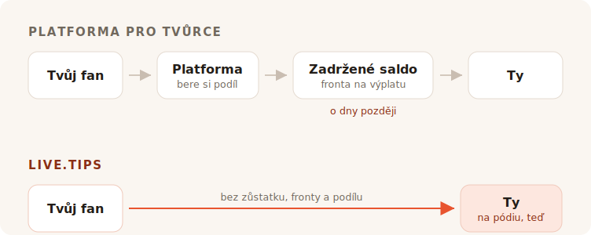

Dohraješ set. V sále je hluk, někdo u baru křičí o přídavek a asi osm sekund má
každý před tebou chuť dát ti peníze. Pak se ten okamžik zavře. Dají se do řeči s
kamarádem, hledají kabát, odcházejí.

Nikdo v tom sále u sebe nemá hotovost. Tak se vydáš hledat kasičku na spropitné a
každý výsledek, na který narazíš, po tobě chce, aby ses stal tvůrcem s vlastní
stránkou.

## K čemu ty nástroje vlastně jsou

Ko-fi, Buy Me a Coffee a Patreon jsou postavené kolem fanouška, který je jinde a
později. Někdo si přečetl tvůj příspěvek, zhlédl video, dočetl komiks — a týdny po
tom, sám s telefonem, se rozhodne poslat ti pět eur. Takový fanoušek má čas. Může
si založit účet. Může si přečíst tvoje úrovně.

Všechno na těch produktech vyplývá z toho jediného předpokladu. Členství, obchod,
exkluzivní příspěvky, galerie, role na Discordu. Je to dobrý předpoklad a slouží mu
dobře. Nebudeme se tvářit jinak: odkaz „kup vývojáři kávu" v tomhle projektu vede
na Buy Me a Coffee a tu práci odvádí dobře.

TipTopJar je blíž terči — je to produkt na spropitné, ne platforma pro tvůrce, a
tiskne QR kód. Ale stejně začíná tím, že ti zarezervuje uživatelské jméno, ověří
tvoji totožnost a chce po tobě účet PayPal Business.

Nic z toho není špatně. Jenom to není pódium.

## Poplatek je ta část, o kterou se všichni přou

Je to zároveň část, kde je poctivá odpověď pro nás méně lichotivá, než by si
marketing přál — tak to udělejme pořádně.

**Ko-fi si bere 0% ze spropitného** a posílá ho rovnou na tvůj vlastní Stripe nebo
PayPal. Jejich slova: *„Na Ko-fi dostáváš zaplaceno přímo, tvoje peníze nikdy
nedržíme."* Jestli chceš členství nebo obchod bez jejich 5% podílu, to je Ko-fi
Gold za $12 měsíčně. Na samotném spropitném je Ko-fi opravdu zdarma a každý, kdo ti
tvrdí, že každá platforma ti ze spropitného ukrajuje, ti něco prodává.

**Buy Me a Coffee si bere 5% ze všeho**, nad rámec vlastních 2.9% + $0.30 Stripu a
dalšího 0.5% poplatku za výplatu. Tvoje peníze pak leží na zůstatku, na který
nesáhneš, dokud nedosáhne $10, a první výplata prochází frontou ke kontrole, která
podle jejich nápovědy trvá obvykle 7 až 14 dní.

**TipTopJar** si účtuje poplatek z každého spropitného, který nechává zaplatit
tvého fanouška navíc k jeho spropitnému — jejich záznam na Product Hunt ho uvádí
jako rovných 5%, i když se to číslo nikde na samotném webu neobjevuje. Bezplatný
plán s sebou nese **jednorázový zřizovací poplatek $9.99** a vyplácí za 3 až 5
pracovních dní; výplaty v týž den stojí $9.99 měsíčně.

Takže: jeden je u spropitného zdarma, druhý si vezme desetinu tvého večera, jakmile
skončí zpracovatel plateb, a třetí si naúčtuje deset dolarů dřív, než tvůj první
fanoušek cokoli naskenuje.

## Nula procent není totéž co nic

Tady je část, kterou všechny tabulky poplatků vynechávají — a právě proto nejsou
spropitné na Ko-fi a spropitné na live.tips stejně velké.

Každý z těch produktů — Ko-fi včetně, a live.tips taky, když běží na Stripu — žene
peníze přes kartového zpracovatele, a kartový zpracovatel si z každé jednotlivé
transakce vezme procento a pevnou částku. Ko-fi je v tomhle upřímné; na jejich
stránce s cenami je hvězdička *„platí i běžné poplatky zpracovatele plateb."* Jejich
0% je opravdové 0%. Je to 0% z toho, co nechá Stripe.

Ta pevná částka je to, co potichu ničí malé spropitné. Paušální poplatek
zpracovatele je stejný u spropitného €2 jako u €200 — a spropitné je ze své
podstaty malé. Spropitné kartou vždycky dopadne o něco lehčí, než jak bylo hozeno.

**Ve spropitném přes Revolut nebo MobilePay není žádný zpracovatel.** Tvůj fanoušek
otevře vlastní Revolut a pošle peníze na tvůj `@username`; převody z Revolutu na
Revolut jsou zdarma a dorazí během pár vteřin. Nebo otevře MobilePay a zaplatí na
tvůj Box, což je ve Finsku zdarma u soukromých převodů pod €400 — hranice, kterou
žádné spropitné pouličního muzikanta nezatíží. Je to totéž, co se stane, když někdo
kamarádovi vrací za pivo, protože přesně to to je: soukromý převod mezi dvěma lidmi.
Žádný obchodník, žádný akvirer, žádné procento, žádných třicet centů.

Spropitné €5 dorazí jako €5. Ne jako €5 minus podíl z ničeho, minus poplatek za
zpracování a minus poplatek za výplatu. Jako €5.

To by mělo znamenat „bez poplatků" a na těch dvou kolejích to můžeme říct bez
hvězdičky. Zvláštní závěr sekce o poplatcích, tak řekněme tu nevyřčenou část:
peníze nikdy nebyly to drahé, co ti berou.

## To, co ti doopravdy berou, je sál

Online stránka na spropitné je soukromá transakce. Musí být — fanoušek je sám.

Spropitné na pódiu soukromé není a v tom je celý mechanismus. Když se kasička na
obrazovce vedle tebe viditelně plní, když se pohne ukazatel cíle, když na displeji
přistane jméno a vzkaz a ty ho přečteš do mikrofonu a řekneš *díky, Miro* — sál
vidí, že se dává. Spropitné přestává být laskavost a stává se něčím, co sál dělá
společně. To není platební funkce. Je to důvod, proč kasička s hotovostí fungovala
čtyři sta let, a je to to, co umřelo, když všichni přestali nosit mince.

Ko-fi má stream alerty a jsou dobré — ale je to OBS overlay mířený na diváka, který
sedí doma před Twitchem. Buy Me a Coffee nemá žádnou živou plochu. TipTopJar ti
vytiskne QR kód a ukáže nástěnku v reálném čase, což je obrazovka pro *tebe*, ne
pro sál.

Ani jeden z nich ti nepostaví kasičku před publikum.

## Nastavení při skládání aparatury

A tady je další věc, kterou online platforma vlastně nespraví, protože vyplývá z
toho, čím ty platformy jsou.

Abys přes live.tips přijal spropitné přes Revolut, napíšeš do aplikace svůj
`@username`. Abys přijal MobilePay, vložíš odkaz na svůj Box. To je celá integrace.
Žádný účet, žádná registrace, žádné ověření totožnosti, žádné bankovní údaje, žádné
čekání na ověřovací e-mail — vteřiny, během zvukovky, vestoje, na telefonu, který
stejně držíš v ruce.

Ko-fi, Buy Me a Coffee a TipTopJar tohle nabídnout nemůžou, a ne proto, že by byly
líné. Celý jejich model vyžaduje, aby seděly uvnitř platby a věděly, že proběhla.
Nemůžeš sedět uvnitř platby, kterou si dva lidé posílají navzájem, takže platforma
ti nikdy nepodá koleje, které nic nestojí. Musí tě provést těmi, které něco stojí.

A přesně tady bychom k tobě měli být upřímní. **Ani live.tips nemůže vědět, že
proběhla.** Revolut a MobilePay nemají jak platbu potvrdit, takže se ta spropitná
objeví na tvé pódiové obrazovce označená jako *neověřená*: zobrazí se, jakmile
fanoušek odešle formulář, ať už platbu dokončí, nebo ne. Srovnáváš si to podle
vlastní bankovní aplikace. To je cena za to, že nikdo nestojí uprostřed, a radši to
sem vytiskneme, než abychom to zametli pod koberec.

Spropitné kartou je ověřená cesta a jde přes Stripe. To znamená účet Stripe na
tvoje jméno — Stripe si dělá vlastní ověření totožnosti, jak každý regulovaný
zpracovatel musí. Co to neznamená, je účet u *nás*: vytvoříš omezený API klíč,
vložíš ho a aplikace komunikuje s `api.stripe.com` a s ničím jiným. Celou cestu
peněz jsme sepsali v [jak live.tips zachází s penězi](post:how-live-tips-handles-money).

## Všechno na jedné stránce

| | live.tips | Ko-fi | Buy Me a Coffee | TipTopJar |
| --- | --- | --- | --- | --- |
| **Podíl ze spropitného** | žádný | žádný | 5% | ~5%, přičtené k spropitnému fanouška |
| **Poplatek za zpracování** | jen Stripu — **vůbec žádný** u Revolut / MobilePay | Stripu / PayPalu, vždycky | Stripu, + 0.5% za výplatu | vlastní zpracovatele |
| **Kdo drží tvoje peníze** | nikdo | nikdo | Buy Me a Coffee | TipTopJar |
| **Kdy je dostaneš** | jakmile se spropitné zúčtuje | jakmile se spropitné zúčtuje | po $10, první výplata 7–14 dní | 3–5 pracovních dní, nebo $9.99/měs. za týž den |
| **Náklady na start** | zdarma | zdarma | zdarma | zřizovací poplatek $9.99 |
| **Účet u nástroje** | žádný | nutný | nutný | nutný, plus ověření totožnosti |
| **Kasička, kterou vidí publikum** | ano | ne | ne | ne |
| **Revolut / MobilePay** | ano | ne | ne | ne |
| **Otevřený zdroj** | MIT | ne | ne | ne |

Poplatky a podmínky výplat podle toho, co jednotlivé služby zveřejňují na vlastních stránkách v červenci 2026, kromě procenta TipTopJar, které se objevuje jen na jeho záznamu na Product Hunt. Převody z Revolutu na Revolut jsou podle Revolutu zdarma; finské soukromé převody v MobilePay jsou zdarma pod €400, nad tuto hranici si berou 1%. Ceny se mění; jdi si je ověřit sám, místo abys věřil konkurentovi na slovo.
{: .footnote }

## Kdy bys live.tips používat neměl

Jestli chceš opakovaná členství, obchod na svoje výtisky, exkluzivní příspěvky a
místo, kde tě fanoušci mezi vystoupeními najdou, pak chceš Ko-fi a měl bys jít
Ko-fi používat. Je to lepší verze tohohle než cokoli, co kdy postavíme, a u
spropitného tě nestojí nic.

live.tips není platforma a ani se jí nesnaží stát. Není tu žádná stránka k
udržování, žádné uživatelské jméno k rezervaci, žádné podmínky použití, se kterými
bys mohl narazit, žádný e-mail o pozastavení účtu v jedenáct večer před koncertem.
Není co pozastavit. Aplikace běží ve tvém prohlížeči, klíč bydlí v klíčence tvého
zařízení, celé to je pod licencí MIT na GitHubu, a kdybychom zítra zmizeli, QR kód
nalepený na pouzdru od kytary by fungoval dál, protože míří na [tvůj vlastní odkaz
Stripe](post:one-qr-code-every-payment-method), ne na nás.

To není slib o našich úmyslech. Je to popis toho, co jsme postavili, a můžeš si to
jít přečíst.

## Vyzkoušej to dřív, než tomu uvěříš

Otevři [aplikaci](/app/?lang=cs), nech Stripe v demo režimu a hoď do kasičky demo
spropitné. Zabere to minutu, nic to nestojí a nemusíš nám k tomu říkat svoje jméno.

A pak to na příštím koncertě postav na stojan a sleduj, co sál udělá, když vidí,
jak se kasička plní.
