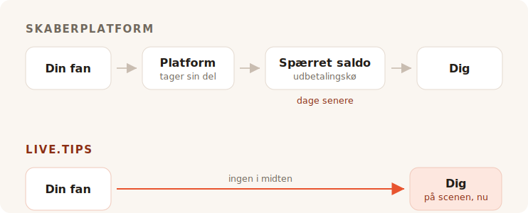

Du spiller sættet færdigt. Rummet larmer, en eller anden nede ved baren råber
efter én til, og i cirka otte sekunder har hver eneste person foran dig lyst til
at give dig penge. Så lukker øjeblikket sig. De taler med deres ven, de leder
efter deres jakke, de går.

Ingen i det rum har kontanter på sig. Så du går på jagt efter en tipkrukke, og
hvert eneste resultat, du finder, beder dig om at blive en indholdsskaber med en
side.

## Hvad de værktøjer egentlig er til

Ko-fi, Buy Me a Coffee og Patreon er bygget op om en fan, der er et andet sted,
senere. En, der læste dit opslag, så din video, blev færdig med din tegneserie —
og uger efter, alene med en telefon, beslutter sig for at sende dig fem euro. Den
fan har tid. De kan oprette en konto. De kan læse dine niveauer.

Alt ved de produkter følger af den ene antagelse. Medlemskaberne, butikken, de
eksklusive opslag, galleriet, Discord-rollerne. Det er en god antagelse, og de
betjener den godt. Vi lægger ikke skjul på det her: dette projekts egen »køb
udvikleren en kop kaffe«-link peger på Buy Me a Coffee, og det klarer den opgave
fint.

TipTopJar er tættere på målet — det er et tip-produkt snarere end en
skaberplatform, og det udskriver en QR-kode. Men det starter stadig med at
reservere dig et brugernavn, verificere din identitet og bede om en PayPal
Business-konto.

Intet af det er forkert. Det er bare ikke en scene.

## Gebyret er det, alle skændes om

Det er også den del, hvor det ærlige svar er mindre flatterende for os, end
marketingen kunne ønske sig, så lad os gøre det ordentligt.

**Ko-fi tager 0 % af et tip**, og betaler det direkte ind på din egen Stripe eller
PayPal. Deres egne ord: *»På Ko-fi bliver du betalt direkte, vi holder aldrig på
dine penge.«* Hvis du vil have medlemskaber eller en butik uden deres 5 %-andel,
er det Ko-fi Gold til 12 $ om måneden. På tips alene er Ko-fi ægte gratis, og
enhver, der fortæller dig, at alle platforme skummer fløden af dine tips, vil
sælge dig noget.

**Buy Me a Coffee tager 5 % af alt**, oven i Stripes egne 2,9 % + 0,30 $ og et
yderligere udbetalingsgebyr på 0,5 %. Dine penge sidder så på en saldo, du ikke
kan røre, før den når 10 $, og den første udbetaling går gennem en godkendelseskø,
der ifølge deres hjælpecenter typisk tager 7 til 14 dage.

**TipTopJar** opkræver et gebyr pr. tip, som det beder din fan om at dække oven i
sit tip — deres Product Hunt-opslag kalder det et fast gebyr på 5 %, selvom tallet
ikke optræder nogen steder på selve siden. Gratisplanen har et
**engangsopstartsgebyr på 9,99 $** og udbetaler på 3 til 5 hverdage; udbetalinger
samme dag koster 9,99 $ om måneden.

Altså: den ene er gratis på tips, den anden tager en tiendedel af din aften, når
betalingsudbyderen er færdig, og den tredje opkræver ti dollar af dig, før din
første fan har scannet noget som helst.

## Nul procent er ikke det samme som ingenting

Her er den del, som alle gebyrtabellerne udelader, og det er grunden til, at et
Ko-fi-tip og et live.tips-tip ikke er lige store.

Hver eneste af disse produkter — Ko-fi inklusive, og live.tips også, når det kører
på Stripe — flytter penge gennem en kortudbyder, og en kortudbyder tager en
procentdel og et fast beløb af hver eneste transaktion. Ko-fi er ærlig omkring
det; deres prisside bærer stjernen *»almindelige gebyrer fra betalingsudbyderen
gælder også.«* Deres 0 % er et ægte 0 %. Det er 0 % af det, Stripe efterlader.

Det faste beløb er det, der stille og roligt ødelægger små tips. En udbyders faste
gebyr er det samme på et tip på 2 € som på et på 200 €, og tips er små af natur.
Et kort-tip lander altid en anelse lettere, end det blev kastet.

**Et Revolut- eller MobilePay-tip har slet ingen betalingsudbyder i sig.** Din fan
åbner sin egen Revolut og sender penge til dit `@username`; Revolut-til-Revolut-
overførsler er gratis og lander på sekunder. Eller de åbner MobilePay og betaler
til din Box, hvilket i Finland er gratis for personlige overførsler under 400 € —
en grænse, som ingen gademusikers tip kommer i nærheden af. Det er det samme, der
sker, når nogen betaler en ven tilbage for en øl, for det er bogstaveligt talt,
hvad det er: en personlig overførsel mellem to mennesker. Ingen forretning, ingen
indløser, ingen procentdel, ingen tredive cent.

Et tip på 5 € ankommer som 5 €. Ikke som 5 € minus en andel af ingenting, minus et
behandlingsgebyr og minus et udbetalingsgebyr. Som 5 €.

Det er, hvad »ingen gebyrer« burde betyde, og på de to skinner kan vi sige det
uden en stjerne. Hvilket er en mærkelig ting at konkludere i et gebyrafsnit, så
lad os sige det stille: pengene var aldrig det dyre, de tager.

## Det, de faktisk tager, er rummet

En online tipside er en privat transaktion. Det er den nødt til at være — fanen er
alene.

Et tip på scenen er ikke privat, og det er hele mekanikken. Når krukken på skærmen
ved siden af dig synligt fyldes, når målbjælken rykker sig, når et navn og en
besked lander på skærmen, og du læser det op i mikrofonen og siger *tak, Mira* —
så ser rummet, at der bliver givet. Det at give holder op med at være en tjeneste
og bliver noget, rummet gør sammen. Det er ikke en betalingsfunktion. Det er
grunden til, at kontantkrukken virkede i fire hundrede år, og det er det, der
døde, da alle holdt op med at gå rundt med mønter.

Ko-fi har stream-alerts, og det er gode af slagsen — men de er et OBS-overlay,
rettet mod en seer, der sidder derhjemme foran Twitch. Buy Me a Coffee har slet
ingen live-flade. TipTopJar udskriver en QR-kode til dig og viser dig et
realtidsdashboard, hvilket er en skærm til *dig*, ikke til rummet.

Ikke én af dem vil sætte en krukke foran dit publikum.

## Sat op, mens I bærer ind

Her er den anden ting, en online platform ikke rigtig kan løse, fordi den ligger
nedstrøms af, hvad de er.

For at tage imod et Revolut-tip med live.tips skriver du dit `@username` ind i
appen. For at tage imod MobilePay indsætter du dit Box-link. Det er hele
integrationen. Ingen konto, ingen tilmelding, ingen identitetskontrol, ingen
bankoplysninger, ingen venten på en bekræftelsesmail — sekunder, under lydprøven,
stående op, på den telefon, du allerede har i hånden.

Ko-fi, Buy Me a Coffee og TipTopJar kan ikke tilbyde det, og ikke fordi de er
dovne. Hele deres model kræver, at de sidder inde i betalingen og ved, at den
skete. Man kan ikke sidde inde i en betaling, som to mennesker foretager til
hinanden, så en platform kan aldrig række dig de skinner, der intet koster. Den er
nødt til at lede dig gennem dem, der gør.

Hvilket er præcis der, hvor vi bør være ærlige over for dig. **live.tips kan heller
ikke vide, at det skete.** Revolut og MobilePay har ingen måde at bekræfte en
betaling på, så de tips dukker op på skærmen på scenen markeret som *ubekræftet*:
de vises, når fanen indsender formularen, uanset om de gør betalingen færdig eller
ej. Du afstemmer mod din egen bankapp. Det er prisen for, at ingen står i midten,
og vi vil hellere trykke det her end begrave det.

Kort-tips er den bekræftede vej, og de går gennem Stripe. Det betyder en
Stripe-konto i dit navn — Stripe laver sin egen identitetskontrol, som enhver
reguleret betalingsudbyder må. Hvad det ikke betyder, er en konto hos *os*: du
opretter en begrænset API-nøgle, indsætter den, og appen taler med
`api.stripe.com` og intet andet sted. Vi har skrevet hele pengevejen op i
[hvordan live.tips håndterer penge](post:how-live-tips-handles-money).

## Alt på én side

| | live.tips | Ko-fi | Buy Me a Coffee | TipTopJar |
| --- | --- | --- | --- | --- |
| **Andel af et tip** | ingen | ingen | 5 % | ~5 %, lagt oven i fanens tip |
| **Behandlingsgebyr** | Stripes eget — **slet intet** på Revolut / MobilePay | Stripes / PayPals, altid | Stripes, + 0,5 % udbetaling | udbyderens eget |
| **Hvem holder på dine penge** | ingen | ingen | Buy Me a Coffee | TipTopJar |
| **Hvornår du får dem** | når tippet går igennem | når tippet går igennem | efter 10 $, første udbetaling 7–14 dage | 3–5 hverdage, eller 9,99 $/md for samme dag |
| **Pris for at starte** | gratis | gratis | gratis | opstartsgebyr på 9,99 $ |
| **Konto hos værktøjet** | ingen | påkrævet | påkrævet | påkrævet, plus en id-kontrol |
| **En krukke publikum kan se** | ja | nej | nej | nej |
| **Revolut / MobilePay** | ja | nej | nej | nej |
| **Open source** | MIT | nej | nej | nej |

Gebyrer og udbetalingsvilkår som offentliggjort på hver tjenestes egne sider i juli 2026, undtagen TipTopJars procentsats, som kun optræder på dens Product Hunt-opslag. Revolut-til-Revolut-overførsler er gratis ifølge Revolut; MobilePays finske personlige overførsler er gratis under 400 €, hvorover den tager 1 %. Priser ændrer sig; gå selv og tjek dem frem for at tage en konkurrents ord for det.
{: .footnote }

## Hvornår du ikke bør bruge live.tips

Hvis du vil have tilbagevendende medlemskaber, en butik til dine tryk, eksklusive
opslag og et sted, fans kan finde dig mellem koncerterne, så vil du have Ko-fi, og
så skal du bruge Ko-fi. Det er en bedre version af det end noget, vi nogensinde
kommer til at bygge, og det koster dig intet på tips.

live.tips er ikke en platform og forsøger ikke at blive det. Der er ingen side at
vedligeholde, intet brugernavn at reservere, ingen servicevilkår at falde i unåde
med, ingen suspenderingsmail at modtage klokken elleve om aftenen før en koncert.
Der er intet at suspendere. Appen kører i din browser, nøglen bor i din enheds
nøglering, det hele er MIT-licenseret på GitHub, og hvis vi forsvandt i morgen,
ville QR-koden, der er tapet på din guitarkasse, blive ved med at virke, fordi den
peger på [dit eget Stripe-link](post:one-qr-code-every-payment-method), ikke på os.

Det er ikke et løfte om vores hensigter. Det er en beskrivelse af, hvad vi byggede,
og du kan gå og læse det.

## Prøv det, før du stoler på det

Åbn [appen](/app/?lang=da), lad Stripe stå i demo-tilstand, og kast et demo-tip i
krukken. Det tager et minut, det koster intet, og du behøver ikke fortælle os dit
navn for at gøre det.

Sæt den så på et stativ til din næste koncert, og se, hvad rummet gør, når det kan
se krukken fylde sig.
