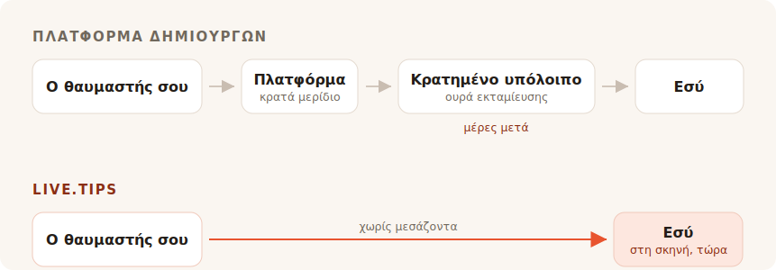

Τελειώνεις το σετ. Η αίθουσα βουίζει, κάποιος κοντά στο μπαρ φωνάζει για άλλο ένα,
και για κάπου οκτώ δευτερόλεπτα ο καθένας μπροστά σου θέλει να σου δώσει χρήματα.
Μετά η στιγμή κλείνει. Γυρνούν στην κουβέντα με τον φίλο τους, ψάχνουν το παλτό
τους, φεύγουν.

Μετρητά δεν έχει κανείς σ' εκείνη την αίθουσα. Έτσι ψάχνεις για έναν κουμπαρά
φιλοδωρημάτων, και κάθε αποτέλεσμα που βρίσκεις σού ζητά να γίνεις δημιουργός με
σελίδα.

## Για ποιον λόγο φτιάχτηκαν πραγματικά αυτά τα εργαλεία

Το Ko-fi, το Buy Me a Coffee και το Patreon είναι χτισμένα γύρω από έναν θαυμαστή
που βρίσκεται κάπου αλλού, αργότερα. Κάποιος διάβασε την ανάρτησή σου, είδε το
βίντεό σου, τελείωσε το κόμικ σου — και εβδομάδες μετά, μόνος με το κινητό,
αποφασίζει να σου στείλει πέντε ευρώ. Αυτός ο θαυμαστής έχει χρόνο. Μπορεί να
φτιάξει λογαριασμό. Μπορεί να διαβάσει τα επίπεδά σου.

Όλα σ' αυτά τα προϊόντα απορρέουν από μία και μόνη παραδοχή. Οι συνδρομές, το
κατάστημα, οι αποκλειστικές αναρτήσεις, η γκαλερί, οι ρόλοι στο Discord. Είναι
καλή παραδοχή, και την εξυπηρετούν καλά. Δεν το κρύβουμε: ο σύνδεσμος «κέρασε τον
προγραμματιστή έναν καφέ» αυτού του ίδιου του project οδηγεί στο Buy Me a Coffee,
και τη δουλειά αυτή την κάνει μια χαρά.

Το TipTopJar πλησιάζει περισσότερο τον στόχο — είναι προϊόν φιλοδωρημάτων παρά
πλατφόρμα δημιουργών, και τυπώνει έναν κωδικό QR. Αλλά κι αυτό ξεκινά κρατώντας σου
ένα όνομα χρήστη, επαληθεύοντας την ταυτότητά σου και ζητώντας έναν λογαριασμό
PayPal Business.

Τίποτα απ' αυτά δεν είναι λάθος. Απλώς δεν είναι σκηνή.

## Η προμήθεια είναι το κομμάτι για το οποίο μαλώνουν όλοι

Είναι επίσης το κομμάτι όπου η ειλικρινής απάντηση μάς κολακεύει λιγότερο απ' όσο
θα ήθελε το μάρκετινγκ — ας το κάνουμε λοιπόν σωστά.

**Το Ko-fi παίρνει 0% από ένα φιλοδώρημα** και το καταθέτει κατευθείαν στο δικό σου
Stripe ή PayPal. Με τα λόγια τους: *«Στο Ko-fi πληρώνεσαι απευθείας, ποτέ δεν
κρατάμε τα χρήματά σου.»* Αν θέλεις συνδρομές ή κατάστημα χωρίς το 5% τους, αυτό
είναι το Ko-fi Gold με $12 τον μήνα. Στα σκέτα φιλοδωρήματα, το Ko-fi είναι
πραγματικά δωρεάν, και όποιος σου λέει ότι κάθε πλατφόρμα ξαφρίζει τα φιλοδωρήματά
σου, κάτι σου πουλάει.

**Το Buy Me a Coffee παίρνει 5% από τα πάντα**, πάνω από τα δικά του Stripe 2.9% +
$0.30 και ένα ακόμη 0.5% προμήθειας εκταμίευσης. Έπειτα τα χρήματά σου κάθονται σε
ένα υπόλοιπο που δεν μπορείς να αγγίξεις μέχρι να φτάσει τα $10, και η πρώτη
εκταμίευση περνά από μια ουρά ελέγχου που, σύμφωνα με το κέντρο βοήθειάς τους,
συνήθως παίρνει 7 έως 14 μέρες.

**Το TipTopJar** χρεώνει μια προμήθεια ανά φιλοδώρημα την οποία ζητά από τον
θαυμαστή σου να καλύψει πάνω από το φιλοδώρημά του — η καταχώρισή του στο Product
Hunt τη λέει σταθερό 5%, αν και ο αριθμός δεν εμφανίζεται πουθενά στο ίδιο το site.
Το δωρεάν πλάνο κουβαλά ένα **εφάπαξ κόστος ρύθμισης $9.99** και πληρώνει σε 3 έως
5 εργάσιμες μέρες· οι αυθημερόν εκταμιεύσεις κοστίζουν $9.99 τον μήνα.

Λοιπόν: το ένα είναι δωρεάν στα φιλοδωρήματα, το άλλο παίρνει το ένα δέκατο της
βραδιάς σου αφού τελειώσει ο επεξεργαστής, και το τρίτο σου χρεώνει δέκα δολάρια
πριν καν σαρώσει κάτι ο πρώτος σου θαυμαστής.

## Το μηδέν τοις εκατό δεν είναι το ίδιο με το τίποτα

Να το κομμάτι που όλοι οι πίνακες προμηθειών παραλείπουν, και είναι ο λόγος που ένα
φιλοδώρημα στο Ko-fi κι ένα φιλοδώρημα στο live.tips δεν έχουν το ίδιο μέγεθος.

Καθένα απ' αυτά τα προϊόντα — και το Ko-fi συμπεριλαμβανομένου, και το live.tips
επίσης όταν τρέχει πάνω στο Stripe — μετακινεί χρήματα μέσα από έναν επεξεργαστή
καρτών, κι ένας επεξεργαστής καρτών παίρνει ένα ποσοστό κι ένα σταθερό ποσό από
κάθε μία συναλλαγή. Το Ko-fi είναι ειλικρινές γι' αυτό· η σελίδα τιμολόγησής του
φέρει τον αστερίσκο *«ισχύουν επίσης οι συνήθεις χρεώσεις του επεξεργαστή
πληρωμών.»* Το 0% τους είναι ένα πραγματικό 0%. Είναι 0% απ' ό,τι αφήνει το Stripe.

Αυτό το σταθερό ποσό είναι που σιωπηλά καταστρέφει τα μικρά φιλοδωρήματα. Η πάγια
χρέωση ενός επεξεργαστή είναι η ίδια σ' ένα φιλοδώρημα €2 όπως και σ' ένα των €200,
και τα φιλοδωρήματα είναι μικρά από τη φύση τους. Ένα φιλοδώρημα με κάρτα
προσγειώνεται πάντα λίγο πιο ελαφρύ απ' όσο ρίχτηκε.

**Ένα φιλοδώρημα μέσω Revolut ή MobilePay δεν έχει καθόλου επεξεργαστή μέσα του.**
Ο θαυμαστής σου ανοίγει το δικό του Revolut και στέλνει χρήματα στο `@username`
σου· οι μεταφορές Revolut-προς-Revolut είναι δωρεάν και φτάνουν σε δευτερόλεπτα. Ή
ανοίγει το MobilePay και πληρώνει στο Box σου, που στη Φινλανδία είναι δωρεάν για
προσωπικές μεταφορές κάτω των €400 — ένα όριο που το φιλοδώρημα κανενός πλανόδιου
μουσικού δεν πρόκειται να ενοχλήσει. Είναι το ίδιο πράγμα που συμβαίνει όταν κάποιος
ξεπληρώνει έναν φίλο για μια μπίρα, γιατί κυριολεκτικά αυτό είναι: μια προσωπική
μεταφορά ανάμεσα σε δύο ανθρώπους. Κανένας έμπορος, κανένας acquirer, κανένα
ποσοστό, κανένα τριάντα σεντ.

Ένα φιλοδώρημα των €5 φτάνει ως €5. Όχι ως €5 μείον ένα μερίδιο από το τίποτα, και
μείον μια χρέωση επεξεργασίας, και μείον μια χρέωση εκταμίευσης. Ως €5.

Αυτό θα έπρεπε να σημαίνει το «χωρίς χρεώσεις», και πάνω σ' αυτές τις δύο ράγες
μπορούμε να το πούμε χωρίς αστερίσκο. Παράξενο συμπέρασμα για ένα κομμάτι περί
προμηθειών, ας πούμε λοιπόν το ανείπωτο: τα χρήματα δεν ήταν ποτέ το ακριβό πράγμα
που παίρνουν.

## Αυτό που πραγματικά παίρνουν είναι η αίθουσα

Μια διαδικτυακή σελίδα φιλοδωρήματος είναι μια ιδιωτική συναλλαγή. Πρέπει να είναι —
ο θαυμαστής είναι μόνος.

Ένα φιλοδώρημα στη σκηνή δεν είναι ιδιωτικό, κι εκεί βρίσκεται όλος ο μηχανισμός.
Όταν ο κουμπαράς στην οθόνη δίπλα σου γεμίζει ορατά, όταν η μπάρα του στόχου
κινείται, όταν ένα όνομα κι ένα μήνυμα προσγειώνονται στην οθόνη κι εσύ το διαβάζεις
στο μικρόφωνο και λες *ευχαριστώ, Μίρα* — η αίθουσα βλέπει ότι συμβαίνει προσφορά.
Το φιλοδώρημα παύει να είναι χάρη και γίνεται κάτι που η αίθουσα κάνει μαζί. Αυτό
δεν είναι λειτουργία πληρωμών. Είναι ο λόγος που ο κουμπαράς με τα μετρητά δούλευε
για τετρακόσια χρόνια, κι είναι αυτό που πέθανε όταν όλοι έπαψαν να κουβαλούν
κέρματα.

Το Ko-fi έχει ειδοποιήσεις stream, και μάλιστα καλές — αλλά είναι ένα overlay του
OBS, στραμμένο σ' έναν θεατή που κάθεται σπίτι μπροστά στο Twitch. Το Buy Me a
Coffee δεν έχει καμία ζωντανή επιφάνεια. Το TipTopJar θα σου τυπώσει έναν κωδικό QR
και θα σου δείξει έναν πίνακα σε πραγματικό χρόνο, που είναι μια οθόνη για *εσένα*,
όχι για την αίθουσα.

Ούτε ένα απ' αυτά δεν θα βάλει έναν κουμπαρά μπροστά στο κοινό σου.

## Στήσιμο την ώρα που κουβαλάς τον εξοπλισμό

Να και το άλλο πράγμα που μια διαδικτυακή πλατφόρμα δεν μπορεί στ' αλήθεια να
διορθώσει, γιατί είναι απόρροια του τι είναι.

Για να δεχτείς ένα φιλοδώρημα Revolut με το live.tips πληκτρολογείς το `@username`
σου στην εφαρμογή. Για να δεχτείς MobilePay επικολλάς τον σύνδεσμο του Box σου.
Αυτή είναι όλη η ενσωμάτωση. Κανένας λογαριασμός, καμία εγγραφή, κανένας έλεγχος
ταυτότητας, κανένα τραπεζικό στοιχείο, καμία αναμονή για email επαλήθευσης —
δευτερόλεπτα, στο soundcheck, όρθιος, στο κινητό που ήδη κρατάς.

Το Ko-fi, το Buy Me a Coffee και το TipTopJar δεν μπορούν να το προσφέρουν αυτό, κι
όχι επειδή τεμπελιάζουν. Όλο τους το μοντέλο απαιτεί να κάθονται μέσα στην πληρωμή
και να ξέρουν ότι έγινε. Δεν μπορείς να κάθεσαι μέσα σε μια πληρωμή που δύο άνθρωποι
κάνουν ο ένας στον άλλον, οπότε μια πλατφόρμα δεν μπορεί ποτέ να σου δώσει τις ράγες
που δεν κοστίζουν τίποτα. Είναι αναγκασμένη να σε δρομολογήσει μέσα από εκείνες που
κοστίζουν.

Κι εδώ ακριβώς πρέπει να είμαστε ειλικρινείς μαζί σου. **Ούτε το live.tips μπορεί
να ξέρει ότι έγινε.** Το Revolut και το MobilePay δεν έχουν τρόπο να επιβεβαιώσουν
μια πληρωμή, οπότε αυτά τα φιλοδωρήματα εμφανίζονται στην οθόνη της σκηνής σου με τη
σήμανση *ανεπιβεβαίωτα*: εμφανίζονται μόλις ο θαυμαστής υποβάλει τη φόρμα, είτε
ολοκληρώσει την πληρωμή είτε όχι. Τα συμφωνείς εσύ με τη δική σου τραπεζική
εφαρμογή. Αυτό είναι το τίμημα του να μη στέκεται κανείς στη μέση, και προτιμούμε να
το τυπώσουμε εδώ παρά να το θάψουμε.

Τα φιλοδωρήματα με κάρτα είναι η επιβεβαιωμένη διαδρομή, και περνούν μέσα από το
Stripe. Αυτό σημαίνει έναν λογαριασμό Stripe στο όνομά σου — το Stripe κάνει τον
δικό του έλεγχο ταυτότητας, όπως οφείλει κάθε ρυθμιζόμενος επεξεργαστής. Αυτό που
δεν σημαίνει είναι λογαριασμό σε *εμάς*: δημιουργείς ένα περιορισμένο κλειδί API, το
επικολλάς, και η εφαρμογή μιλά με το `api.stripe.com` και με πουθενά αλλού. Γράψαμε
ολόκληρη τη διαδρομή του χρήματος στο [πώς το live.tips διαχειρίζεται τα
χρήματα](post:how-live-tips-handles-money).

## Όλα σε μία σελίδα

| | live.tips | Ko-fi | Buy Me a Coffee | TipTopJar |
| --- | --- | --- | --- | --- |
| **Μερίδιο από φιλοδώρημα** | κανένα | κανένα | 5% | ~5%, προστίθεται στο φιλοδώρημα του θαυμαστή |
| **Χρέωση επεξεργασίας** | του ίδιου του Stripe — **καμία απολύτως** σε Revolut / MobilePay | του Stripe / PayPal, πάντα | του Stripe, + 0.5% εκταμίευσης | του ίδιου του επεξεργαστή |
| **Ποιος κρατά τα χρήματά σου** | κανείς | κανείς | Buy Me a Coffee | TipTopJar |
| **Πότε τα παίρνεις** | μόλις περάσει το φιλοδώρημα | μόλις περάσει το φιλοδώρημα | μετά τα $10, πρώτη εκταμίευση 7–14 μέρες | 3–5 εργάσιμες μέρες, ή $9.99/μήνα για αυθημερόν |
| **Κόστος εκκίνησης** | δωρεάν | δωρεάν | δωρεάν | $9.99 κόστος ρύθμισης |
| **Λογαριασμός στο εργαλείο** | κανένας | απαιτείται | απαιτείται | απαιτείται, συν έλεγχος ταυτότητας |
| **Κουμπαράς που βλέπει το κοινό** | ναι | όχι | όχι | όχι |
| **Revolut / MobilePay** | ναι | όχι | όχι | όχι |
| **Ανοιχτός κώδικας** | MIT | όχι | όχι | όχι |

Οι χρεώσεις και οι όροι εκταμίευσης όπως δημοσιεύονται στις σελίδες κάθε υπηρεσίας τον Ιούλιο του 2026, εκτός από το ποσοστό του TipTopJar, που εμφανίζεται μόνο στην καταχώρισή του στο Product Hunt. Οι μεταφορές Revolut-προς-Revolut είναι δωρεάν σύμφωνα με τη Revolut· οι φινλανδικές προσωπικές μεταφορές του MobilePay είναι δωρεάν κάτω των €400, πάνω από τα οποία παίρνει 1%. Οι τιμές αλλάζουν· πήγαινε και έλεγξέ τες μόνος σου αντί να πιστεύεις τον λόγο ενός ανταγωνιστή.
{: .footnote }

## Πότε δεν πρέπει να χρησιμοποιείς το live.tips

Αν θέλεις επαναλαμβανόμενες συνδρομές, ένα κατάστημα για τα prints σου,
αποκλειστικές αναρτήσεις κι ένα μέρος όπου οι θαυμαστές σε βρίσκουν ανάμεσα στις
παραστάσεις, τότε θέλεις το Ko-fi, και πήγαινε να χρησιμοποιήσεις το Ko-fi. Είναι
καλύτερη εκδοχή αυτού απ' οτιδήποτε θα φτιάξουμε ποτέ εμείς, και δεν σου κοστίζει
τίποτα στα φιλοδωρήματα.

Το live.tips δεν είναι πλατφόρμα και δεν προσπαθεί να γίνει. Δεν υπάρχει σελίδα να
συντηρείς, ούτε όνομα χρήστη να κρατήσεις, ούτε όροι χρήσης να παραβείς, ούτε email
αναστολής να λάβεις στις έντεκα το βράδυ πριν από μια παράσταση. Δεν υπάρχει τίποτα
να ανασταλεί. Η εφαρμογή τρέχει στον browser σου, το κλειδί ζει στην κλειδοθήκη της
συσκευής σου, όλο το πράγμα είναι με άδεια MIT στο GitHub, κι αν εξαφανιζόμασταν
αύριο, ο κωδικός QR κολλημένος στη θήκη της κιθάρας σου θα συνέχιζε να δουλεύει,
γιατί δείχνει στον [δικό σου σύνδεσμο Stripe](post:one-qr-code-every-payment-method),
όχι σ' εμάς.

Αυτό δεν είναι υπόσχεση για τις προθέσεις μας. Είναι περιγραφή αυτού που φτιάξαμε,
και μπορείς να πας να το διαβάσεις.

## Δοκίμασέ το πριν το εμπιστευτείς

Άνοιξε την [εφαρμογή](/app/?lang=el), άφησε το Stripe σε λειτουργία demo, και ρίξε
ένα demo φιλοδώρημα στον κουμπαρά. Παίρνει ένα λεπτό, δεν κοστίζει τίποτα, και δεν
χρειάζεται να μας πεις το όνομά σου για να το κάνεις.

Μετά βάλ' το σε μια βάση στην επόμενη παράστασή σου και δες τι κάνει η αίθουσα όταν
μπορεί να δει τον κουμπαρά να γεμίζει.
