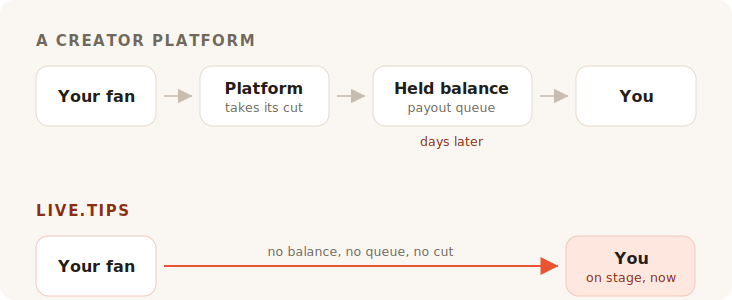

You finish the set. The room is loud, somebody near the bar is shouting for one
more, and for about eight seconds every person in front of you feels like giving
you money. Then the moment closes. They talk to their friend, they look for their
coat, they leave.

Nobody in that room is carrying cash. So you go looking for a tip jar, and every
result you find asks you to become a creator with a page.

## What those tools are actually for

Ko-fi, Buy Me a Coffee and Patreon are built around a fan who is somewhere else,
later. Someone read your post, watched your video, finished your comic — and
weeks after the fact, alone with a phone, decides to send you five euros. That
fan has time. They can make an account. They can read your tiers.

Everything about those products follows from that one assumption. The memberships,
the shop, the exclusive posts, the gallery, the Discord roles. It is a good
assumption, and they serve it well. We are not being coy here: this project's own
"buy the developer a coffee" link goes to Buy Me a Coffee, and it does that job
fine.

TipTopJar is closer to the mark — it is a tipping product rather than a creator
platform, and it prints a QR code. But it still starts by reserving you a username,
verifying your identity, and asking for a PayPal Business account.

None of that is wrong. It is just not a stage.

## The fee is the part everyone argues about

It is also the part where the honest answer is less flattering to us than the
marketing would like, so let us do it properly.

**Ko-fi takes 0% of a tip**, and pays it straight into your own Stripe or PayPal.
Their words: *"On Ko-fi, you get paid directly, we never hold your money."* If you
want memberships or a shop without their 5% cut, that is Ko-fi Gold at $12 a
month. On tips alone, Ko-fi is genuinely free, and anyone telling you every
platform skims your tips is selling you something.

**Buy Me a Coffee takes 5% of everything**, on top of Stripe's own 2.9% + $0.30
and a further 0.5% payout fee. Your money then sits in a balance you cannot touch
until it reaches $10, and the first payout goes through a review queue that their
help centre says typically takes 7 to 14 days.

**TipTopJar** charges a per-tip fee that it asks your fan to cover on top of their
tip — their Product Hunt listing calls it a flat 5%, though the number appears
nowhere on the site itself. The free plan carries a **$9.99 one-time setup fee**
and pays out in 3 to 5 business days; same-day payouts cost $9.99 a month.

So: one of them is free on tips, one takes a tenth of your night once the
processor is done, and one charges you ten dollars before your first fan has
scanned anything.

## Nought per cent is not the same as nothing

Here is the part the fee tables all leave out, and it is the reason a Ko-fi tip
and a live.tips tip are not the same size.

Every one of these products — Ko-fi included, and live.tips too when it is running
on Stripe — moves money through a card processor, and a card processor takes a
percentage and a fixed amount off every single transaction. Ko-fi is honest about
this; their pricing page carries the asterisk *"normal payment processor fees also
apply."* Their 0% is a real 0%. It is 0% of what Stripe leaves.

That fixed amount is what quietly ruins small tips. A processor's flat charge is
the same on a €2 tip as on a €200 one, and tips are small by nature. A card tip
always lands a little lighter than it was thrown.

**A Revolut or MobilePay tip has no processor in it at all.** Your fan opens their
own Revolut and sends money to your `@username`; Revolut-to-Revolut transfers are
free and land in seconds. Or they open MobilePay and pay into your Box, which in
Finland is free for personal transfers under €400 — a threshold no busker's tip is
going to trouble. It is the same thing that happens when somebody pays a friend
back for a beer, because that is literally what it is: a personal transfer between
two people. No merchant, no acquirer, no percentage, no thirty cents.

A €5 tip arrives as €5. Not as €5 minus a cut of nothing, and minus a processing
fee, and minus a payout fee. As €5.

That is what "no fees" ought to mean, and on those two rails we can say it without
an asterisk. Which is a strange thing for a fee section to conclude, so let us say
the quiet part: the money was never the expensive thing they take.

## What they actually take is the room

An online tip page is a private transaction. It has to be — the fan is alone.

A tip on stage is not private, and that is the whole mechanism. When the jar on
the screen beside you visibly fills, when the goal bar moves, when a name and a
message land on the display and you read it into the microphone and say *thanks,
Mira* — the room sees that giving is happening. Tipping stops being a favour and
becomes something the room is doing together. That is not a payments feature. It
is the reason the cash jar worked for four hundred years, and it is the thing that
died when everybody stopped carrying coins.

Ko-fi has stream alerts, and they are good ones — but they are an OBS overlay,
aimed at a viewer sitting at home in front of Twitch. Buy Me a Coffee has no live
surface at all. TipTopJar will print you a QR code and show you a real-time
dashboard, which is a screen for *you*, not for the room.

Not one of them will put a jar in front of your audience.

## Setting up during load-in

Here is the other thing an online platform cannot really fix, because it is
downstream of what they are.

To take a Revolut tip with live.tips you type your `@username` into the app. To
take MobilePay you paste your Box link. That is the entire integration. No account,
no sign-up, no identity check, no bank details, no waiting for a verification
email — seconds, during soundcheck, standing up, on the phone already in your hand.

Ko-fi, Buy Me a Coffee and TipTopJar cannot offer that, and not because they are
lazy. Their entire model requires them to sit inside the payment and know that it
happened. You cannot sit inside a payment that two people make to each other, so a
platform can never hand you the rails that cost nothing. It has to route you
through the ones that do.

Which is exactly where we should be honest with you. **live.tips cannot know it
happened either.** Revolut and MobilePay have no way to confirm a payment, so those
tips show up on your stage screen marked *unverified*: they appear when the fan
submits the form, whether or not they finish paying. You reconcile against your own
banking app. That is the price of nobody standing in the middle, and we would
rather print it here than bury it.

Card tips are the verified path, and they run through Stripe. That means a Stripe
account in your name — Stripe does its own identity check, as any regulated
processor must. What it does not mean is an account with *us*: you create a
restricted API key, paste it in, and the app talks to `api.stripe.com` and nowhere
else. We wrote up the whole money path in
[how live.tips handles money](post:how-live-tips-handles-money).

## Everything on one page

| | live.tips | Ko-fi | Buy Me a Coffee | TipTopJar |
| --- | --- | --- | --- | --- |
| **Cut of a tip** | none | none | 5% | ~5%, added to the fan's tip |
| **Processing fee** | Stripe's own — **none at all** on Revolut / MobilePay | Stripe's / PayPal's, always | Stripe's, + 0.5% payout | processor's own |
| **Who holds your money** | nobody | nobody | Buy Me a Coffee | TipTopJar |
| **When you get it** | as the tip clears | as the tip clears | after $10, first payout 7–14 days | 3–5 business days, or $9.99/mo for same-day |
| **Cost to start** | free | free | free | $9.99 setup fee |
| **Account with the tool** | none | required | required | required, plus an ID check |
| **A jar the audience can see** | yes | no | no | no |
| **Revolut / MobilePay** | yes | no | no | no |
| **Open source** | MIT | no | no | no |

Fees and payout terms as published on each service's own pages in July 2026, except TipTopJar's percentage, which appears only on its Product Hunt listing. Revolut-to-Revolut transfers are free per Revolut; MobilePay's Finnish personal transfers are free below €400, above which it takes 1%. Prices change; go and check them yourself rather than taking a competitor's word for it.
{: .footnote }

## When you should not use live.tips

If you want recurring memberships, a shop for your prints, exclusive posts and a
place fans can find you between shows, then you want Ko-fi, and you should go use
Ko-fi. It is a better version of that than anything we will ever build, and it
costs you nothing on tips.

live.tips is not a platform and is not trying to become one. There is no page to
maintain, no username to reserve, no terms of service to fall foul of, no
suspension email to receive at eleven at night before a gig. There is nothing to
suspend. The app runs in your browser, the key lives in your device's keychain, the
whole thing is MIT-licensed on GitHub, and if we vanished tomorrow the QR code
taped to your guitar case would keep working, because it points at
[your own Stripe link](post:one-qr-code-every-payment-method), not at us.

That is not a promise about our intentions. It is a description of what we built,
and you can go read it.

## Try it before you trust it

Open the [app](/app/?lang=en), leave Stripe in demo mode, and toss a demo tip at
the jar. It takes a minute, it costs nothing, and you do not have to tell us your
name to do it.

Then put it on a stand at your next gig and watch what the room does when it can
see the jar filling.
