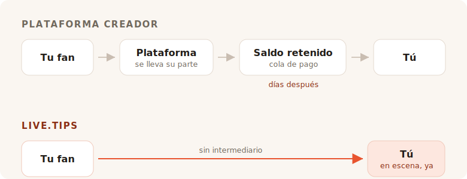

Terminas el set. La sala está ruidosa, alguien cerca de la barra grita pidiendo una
más, y durante unos ocho segundos cada persona que tienes delante siente ganas de
darte dinero. Luego el momento se cierra. Hablan con su amigo, buscan su abrigo, se
marchan.

Nadie en esa sala lleva efectivo. Así que te pones a buscar un bote de propinas, y
cada resultado que encuentras te pide que te conviertas en un creador con una
página.

## Para qué sirven realmente esas herramientas

Ko-fi, Buy Me a Coffee y Patreon están construidos en torno a un fan que está en
otro sitio, más tarde. Alguien leyó tu publicación, vio tu vídeo, terminó tu cómic
— y semanas después, a solas con el móvil, decide enviarte cinco euros. Ese fan
tiene tiempo. Puede crearse una cuenta. Puede leer tus niveles.

Todo en esos productos se deriva de esa única suposición. Las membresías, la tienda,
las publicaciones exclusivas, la galería, los roles de Discord. Es una buena
suposición, y la sirven bien. No vamos a hacernos los tímidos: el propio enlace de
este proyecto para «invitar a un café al desarrollador» lleva a Buy Me a Coffee, y
hace ese trabajo perfectamente.

TipTopJar apunta más cerca del blanco — es un producto de propinas y no una
plataforma de creadores, e imprime un código QR. Pero aun así empieza por reservarte
un nombre de usuario, verificar tu identidad y pedirte una cuenta de PayPal Business.

Nada de eso está mal. Simplemente no es un escenario.

## La comisión es la parte de la que todos discuten

Es también la parte donde la respuesta honesta nos deja peor de lo que al marketing
le gustaría, así que hagámoslo bien.

**Ko-fi se lleva un 0 % de una propina**, y la paga directamente a tu propia cuenta
de Stripe o PayPal. En sus palabras: *«En Ko-fi, cobras directamente, nunca
retenemos tu dinero.»* Si quieres membresías o una tienda sin su comisión del 5 %,
eso es Ko-fi Gold por 12 $ al mes. Solo con propinas, Ko-fi es realmente gratis, y
quien te diga que todas las plataformas mordisquean tus propinas te está vendiendo
algo.

**Buy Me a Coffee se lleva un 5 % de todo**, además del 2,9 % + 0,30 $ propio de
Stripe y una comisión de retirada adicional del 0,5 %. Tu dinero se queda entonces
en un saldo que no puedes tocar hasta que llega a 10 $, y la primera retirada pasa
por una cola de revisión que, según su centro de ayuda, suele tardar de 7 a 14 días.

**TipTopJar** cobra una comisión por propina que le pide a tu fan que cubra por
encima de su propina — su ficha en Product Hunt la describe como un 5 % fijo, aunque
la cifra no aparece por ninguna parte en el propio sitio. El plan gratuito conlleva
una **cuota de configuración única de 9,99 $** y paga en 3 a 5 días hábiles; las
retiradas el mismo día cuestan 9,99 $ al mes.

Así que: uno es gratis con las propinas, uno se queda con una décima parte de tu
noche una vez que el procesador ha terminado, y uno te cobra diez dólares antes de
que tu primer fan haya escaneado nada.

## Cero por ciento no es lo mismo que nada

Aquí está la parte que todas las tablas de comisiones se dejan fuera, y es la razón
por la que una propina de Ko-fi y una propina de live.tips no son del mismo tamaño.

Cada uno de estos productos — Ko-fi incluido, y live.tips también cuando funciona
sobre Stripe — mueve el dinero a través de un procesador de tarjetas, y un
procesador de tarjetas se lleva un porcentaje y una cantidad fija de cada
transacción. Ko-fi es honesto al respecto; su página de precios lleva el asterisco
*«también se aplican las comisiones habituales del procesador de pagos.»* Su 0 % es
un 0 % de verdad. Es el 0 % de lo que Stripe deja.

Esa cantidad fija es lo que arruina en silencio las propinas pequeñas. El cargo fijo
de un procesador es el mismo en una propina de 2 € que en una de 200 €, y las
propinas son pequeñas por naturaleza. Una propina con tarjeta siempre aterriza un
poco más ligera de lo que se lanzó.

**Una propina por Revolut o MobilePay no lleva ningún procesador dentro.** Tu fan
abre su propio Revolut y envía dinero a tu `@username`; las transferencias de
Revolut a Revolut son gratis y llegan en segundos. O abre MobilePay y paga en tu
Box, que en Finlandia es gratis para transferencias personales por debajo de 400 €
— un umbral que ninguna propina de músico callejero va a rozar siquiera. Es lo mismo
que ocurre cuando alguien le devuelve a un amigo el dinero de una cerveza, porque es
literalmente eso: una transferencia personal entre dos personas. Sin comercio, sin
adquirente, sin porcentaje, sin treinta céntimos.

Una propina de 5 € llega como 5 €. No como 5 € menos una comisión de nada, y menos
una comisión de procesamiento, y menos una comisión de retirada. Como 5 €.

Eso es lo que «sin comisiones» debería significar, y en esas dos vías podemos
decirlo sin asterisco. Extraña conclusión para una sección sobre comisiones, así que
digamos la parte que se calla: el dinero nunca fue lo más caro que te quitan.

## Lo que de verdad se llevan es la sala

Una página de propinas en línea es una transacción privada. Tiene que serlo — el fan
está solo.

Una propina en el escenario no es privada, y ahí está todo el mecanismo. Cuando el
bote de la pantalla que tienes al lado se llena a la vista, cuando la barra de
objetivo avanza, cuando un nombre y un mensaje aparecen en la pantalla y los lees
por el micrófono y dices *gracias, Mira* — la sala ve que dar está ocurriendo. La
propina deja de ser un favor y se convierte en algo que la sala hace en conjunto.
Eso no es una función de pagos. Es la razón por la que el bote de monedas funcionó
durante cuatrocientos años, y es lo que murió cuando todo el mundo dejó de llevar
monedas.

Ko-fi tiene alertas de directo, y son buenas — pero son una superposición de OBS,
dirigida a un espectador sentado en casa delante de Twitch. Buy Me a Coffee no tiene
ninguna superficie en directo. TipTopJar te imprimirá un código QR y te mostrará un
panel en tiempo real, que es una pantalla para *ti*, no para la sala.

Ni uno solo de ellos pondrá un bote delante de tu público.

## Configurarlo durante el montaje

Aquí está la otra cosa que una plataforma en línea no puede arreglar realmente,
porque es consecuencia de lo que son.

Para aceptar una propina por Revolut con live.tips escribes tu `@username` en la
app. Para aceptar MobilePay pegas el enlace de tu Box. Esa es toda la integración.
Sin cuenta, sin registro, sin verificación de identidad, sin datos bancarios, sin
esperar un correo de confirmación — segundos, durante la prueba de sonido, de pie,
en el móvil que ya tienes en la mano.

Ko-fi, Buy Me a Coffee y TipTopJar no pueden ofrecer eso, y no porque sean vagos.
Todo su modelo les exige colocarse dentro del pago y saber que ocurrió. No puedes
colocarte dentro de un pago que dos personas se hacen entre sí, así que una
plataforma nunca podrá entregarte las vías que no cuestan nada. Tiene que
encaminarte por las que sí.

Y ahí es exactamente donde debemos ser honestos contigo. **live.tips tampoco puede
saber que ocurrió.** Revolut y MobilePay no tienen forma de confirmar un pago, así
que esas propinas aparecen en tu pantalla de escenario marcadas como *no
verificadas*: aparecen cuando el fan envía el formulario, tanto si termina de pagar
como si no. Tú haces la conciliación con tu propia app bancaria. Ese es el precio de
que nadie esté en el medio, y preferimos imprimirlo aquí que enterrarlo.

Las propinas con tarjeta son la vía verificada, y pasan por Stripe. Eso significa una
cuenta de Stripe a tu nombre — Stripe hace su propia verificación de identidad, como
debe hacer cualquier procesador regulado. Lo que no significa es una cuenta con
*nosotros*: creas una clave de API restringida, la pegas, y la app habla con
`api.stripe.com` y con ningún otro sitio. Escribimos todo el recorrido del dinero en
[cómo live.tips gestiona el dinero](post:how-live-tips-handles-money).

## Todo en una sola página

| | live.tips | Ko-fi | Buy Me a Coffee | TipTopJar |
| --- | --- | --- | --- | --- |
| **Comisión de una propina** | ninguna | ninguna | 5 % | ~5 %, añadido a la propina del fan |
| **Comisión de procesamiento** | la de Stripe — **ninguna** en Revolut / MobilePay | la de Stripe / PayPal, siempre | la de Stripe, + 0,5 % de retirada | la del procesador |
| **Quién retiene tu dinero** | nadie | nadie | Buy Me a Coffee | TipTopJar |
| **Cuándo lo recibes** | en cuanto se valida la propina | en cuanto se valida la propina | tras 10 $, primera retirada en 7–14 días | 3–5 días hábiles, o 9,99 $/mes para el mismo día |
| **Coste de empezar** | gratis | gratis | gratis | 9,99 $ de cuota de configuración |
| **Cuenta con la herramienta** | ninguna | obligatoria | obligatoria | obligatoria, más verificación de identidad |
| **Un bote que el público ve** | sí | no | no | no |
| **Revolut / MobilePay** | sí | no | no | no |
| **Código abierto** | MIT | no | no | no |

Comisiones y condiciones de retirada según lo publicado en las propias páginas de cada servicio en julio de 2026, salvo el porcentaje de TipTopJar, que solo aparece en su ficha de Product Hunt. Las transferencias de Revolut a Revolut son gratis según Revolut; las transferencias personales finlandesas de MobilePay son gratis por debajo de 400 €, por encima de los cuales cobra un 1 %. Los precios cambian; ve a comprobarlos tú mismo en lugar de fiarte de la palabra de un competidor.
{: .footnote }

## Cuándo no deberías usar live.tips

Si quieres membresías recurrentes, una tienda para tus láminas, publicaciones
exclusivas y un lugar donde los fans te encuentren entre conciertos, entonces lo que
quieres es Ko-fi, y deberías ir a usar Ko-fi. Es una versión de eso mejor que
cualquier cosa que nosotros construyamos jamás, y no te cuesta nada con las propinas.

live.tips no es una plataforma y no intenta convertirse en una. No hay página que
mantener, ni nombre de usuario que reservar, ni términos de servicio que incumplir,
ni correo de suspensión que recibir a las once de la noche antes de un concierto. No
hay nada que suspender. La app funciona en tu navegador, la clave vive en el llavero
de tu dispositivo, todo el conjunto está bajo licencia MIT en GitHub, y si
desapareciéramos mañana el código QR pegado a la funda de tu guitarra seguiría
funcionando, porque apunta a [tu propio enlace de Stripe](post:one-qr-code-every-payment-method),
no a nosotros.

Eso no es una promesa sobre nuestras intenciones. Es una descripción de lo que
construimos, y puedes ir a leerla.

## Pruébalo antes de fiarte de él

Abre la [app](/app/?lang=es), deja Stripe en modo demo, y lanza una propina de
demostración al bote. Lleva un minuto, no cuesta nada, y no tienes que decirnos tu
nombre para hacerlo.

Luego ponlo en un atril en tu próximo concierto y observa lo que hace la sala cuando
puede ver el bote llenándose.
