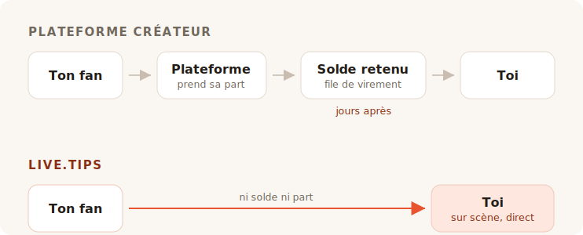

Tu termines ton set. La salle est bruyante, quelqu'un près du bar en réclame un
dernier, et pendant environ huit secondes chaque personne devant toi a envie de
te donner de l'argent. Puis l'instant se referme. Les gens parlent à leur voisin,
cherchent leur manteau, s'en vont.

Personne dans cette salle n'a de liquide sur soi. Alors tu pars à la recherche
d'une cagnotte à pourboires, et chaque résultat que tu trouves te demande de
devenir un créateur avec une page.

## À quoi servent vraiment ces outils

Ko-fi, Buy Me a Coffee et Patreon sont conçus autour d'un fan qui est ailleurs,
plus tard. Quelqu'un a lu ton article, regardé ta vidéo, terminé ta BD — et des
semaines après coup, seul avec son téléphone, décide de t'envoyer cinq euros. Ce
fan a le temps. Il peut se créer un compte. Il peut lire tes paliers.

Tout, dans ces produits, découle de cette seule hypothèse. Les abonnements, la
boutique, les publications exclusives, la galerie, les rôles Discord. C'est une
bonne hypothèse, et ils la servent bien. Soyons francs : le lien « offre un café
au développeur » de ce projet mène lui-même à Buy Me a Coffee, et il fait très
bien ce travail.

TipTopJar vise plus juste — c'est un produit de pourboire plutôt qu'une plateforme
de créateurs, et il imprime un QR code. Mais il commence quand même par te réserver
un nom d'utilisateur, vérifier ton identité et réclamer un compte PayPal Business.

Rien de tout cela n'est mauvais. Ce n'est simplement pas une scène.

## Les frais, c'est ce dont tout le monde débat

C'est aussi la partie où la réponse honnête nous est moins flatteuse que le
marketing ne le voudrait, alors faisons-le correctement.

**Ko-fi prend 0 % d'un pourboire**, et le verse directement sur ton propre compte
Stripe ou PayPal. Selon leurs mots : *« Sur Ko-fi, tu es payé directement, nous ne
conservons jamais ton argent. »* Si tu veux des abonnements ou une boutique sans
leur commission de 5 %, c'est Ko-fi Gold à 12 $ par mois. Sur les seuls pourboires,
Ko-fi est réellement gratuit, et quiconque te dit que toutes les plateformes
grignotent tes pourboires est en train de te vendre quelque chose.

**Buy Me a Coffee prend 5 % de tout**, en plus des 2,9 % + 0,30 $ propres à Stripe
et d'un frais de virement supplémentaire de 0,5 %. Ton argent dort ensuite sur un
solde auquel tu ne peux pas toucher tant qu'il n'atteint pas 10 $, et le premier
virement passe par une file d'attente de vérification qui, selon leur centre d'aide,
prend en général 7 à 14 jours.

**TipTopJar** applique un frais par pourboire qu'il demande à ton fan de couvrir en
plus de son pourboire — sa fiche Product Hunt le présente comme un forfait de 5 %,
même si le chiffre n'apparaît nulle part sur le site lui-même. L'offre gratuite
comporte des **9,99 $ de frais d'installation uniques** et verse sous 3 à 5 jours
ouvrés ; les virements le jour même coûtent 9,99 $ par mois.

Donc : l'un est gratuit sur les pourboires, l'un prend un dixième de ta soirée une
fois que le processeur a fini, et l'un te facture dix dollars avant même que ton
premier fan ait scanné quoi que ce soit.

## Zéro pour cent, ce n'est pas la même chose que rien

Voici la partie que tous les tableaux de frais oublient, et c'est la raison pour
laquelle un pourboire Ko-fi et un pourboire live.tips n'ont pas la même taille.

Chacun de ces produits — Ko-fi compris, et live.tips aussi lorsqu'il tourne sur
Stripe — fait transiter l'argent par un processeur de cartes, et un processeur de
cartes prélève un pourcentage et un montant fixe sur chaque transaction. Ko-fi est
honnête là-dessus ; sa page de tarifs porte l'astérisque *« les frais habituels du
processeur de paiement s'appliquent également. »* Leur 0 % est un vrai 0 %. C'est
0 % de ce que Stripe laisse.

Ce montant fixe, c'est ce qui ruine discrètement les petits pourboires. Le forfait
d'un processeur est le même sur un pourboire de 2 € que sur un de 200 €, et les
pourboires sont petits par nature. Un pourboire par carte arrive toujours un peu
plus léger qu'il n'a été lancé.

**Un pourboire Revolut ou MobilePay ne contient aucun processeur.** Ton fan ouvre
son propre Revolut et envoie de l'argent à ton `@username` ; les virements de
Revolut à Revolut sont gratuits et arrivent en quelques secondes. Ou il ouvre
MobilePay et paie sur ta Box, ce qui en Finlande est gratuit pour les virements
personnels sous 400 € — un seuil qu'aucun pourboire de musicien de rue ne viendra
inquiéter. C'est la même chose qui se produit quand quelqu'un rembourse une bière à
un ami, parce que c'est littéralement ce que c'est : un virement personnel entre
deux personnes. Pas de commerçant, pas d'acquéreur, pas de pourcentage, pas de
trente centimes.

Un pourboire de 5 € arrive comme 5 €. Pas comme 5 € moins une commission de rien,
moins un frais de traitement, moins un frais de virement. Comme 5 €.

C'est ce que « sans frais » devrait vouloir dire, et sur ces deux canaux nous
pouvons le dire sans astérisque. Étrange conclusion pour une section sur les frais,
alors disons tout haut la chose qu'on tait : l'argent n'a jamais été le plus cher
de ce qu'ils te prennent.

## Ce qu'ils prennent vraiment, c'est la salle

Une page de pourboire en ligne est une transaction privée. Elle ne peut pas être
autrement — le fan est seul.

Un pourboire sur scène n'est pas privé, et c'est tout le mécanisme. Quand la
cagnotte à l'écran à côté de toi se remplit visiblement, quand la barre d'objectif
avance, quand un nom et un message s'affichent et que tu les lis au micro en disant
*merci, Mira* — la salle voit que le don est en train de se faire. Le pourboire
cesse d'être une faveur et devient quelque chose que la salle fait ensemble. Ce
n'est pas une fonctionnalité de paiement. C'est la raison pour laquelle la cagnotte
en espèces a fonctionné pendant quatre cents ans, et c'est ce qui est mort quand
tout le monde a cessé de porter de la monnaie.

Ko-fi propose des alertes de stream, et de bonnes alertes — mais ce sont des
overlays OBS, destinés à un spectateur assis chez lui devant Twitch. Buy Me a
Coffee n'a aucune surface en direct. TipTopJar t'imprimera un QR code et
t'affichera un tableau de bord en temps réel, qui est un écran pour *toi*, pas pour
la salle.

Aucun d'entre eux ne mettra une cagnotte devant ton public.

## Tout régler pendant l'installation

Voici l'autre chose qu'une plateforme en ligne ne peut pas vraiment corriger, parce
qu'elle découle de ce qu'elle est.

Pour accepter un pourboire Revolut avec live.tips, tu tapes ton `@username` dans
l'app. Pour accepter MobilePay, tu colles le lien de ta Box. Voilà toute
l'intégration. Pas de compte, pas d'inscription, pas de vérification d'identité, pas
de coordonnées bancaires, pas d'attente d'un e-mail de confirmation — quelques
secondes, pendant la balance, debout, sur le téléphone déjà dans ta main.

Ko-fi, Buy Me a Coffee et TipTopJar ne peuvent pas proposer cela, et pas par
paresse. Tout leur modèle exige qu'ils se placent à l'intérieur du paiement et
sachent qu'il a eu lieu. On ne peut pas se placer à l'intérieur d'un paiement que
deux personnes se font l'une à l'autre, donc une plateforme ne pourra jamais te
tendre les canaux qui ne coûtent rien. Elle est obligée de te faire passer par ceux
qui coûtent.

Et c'est précisément là que nous devons être honnêtes avec toi. **live.tips ne peut
pas non plus savoir que ça a eu lieu.** Revolut et MobilePay n'ont aucun moyen de
confirmer un paiement, alors ces pourboires apparaissent sur ton écran de scène
marqués *non vérifiés* : ils s'affichent dès que le fan envoie le formulaire, qu'il
finisse de payer ou non. Tu fais le rapprochement avec ta propre application
bancaire. C'est le prix à payer pour que personne ne se tienne au milieu, et nous
préférons l'écrire ici que l'enterrer.

Les pourboires par carte sont la voie vérifiée, et ils passent par Stripe. Cela
suppose un compte Stripe à ton nom — Stripe fait sa propre vérification d'identité,
comme tout processeur réglementé se doit de le faire. Ce que cela ne suppose pas,
c'est un compte chez *nous* : tu crées une clé API restreinte, tu la colles, et
l'app parle à `api.stripe.com` et à rien d'autre. Tu *peux* te connecter, si tu veux
que tes groupes et ton historique te suivent sur un deuxième appareil — mais rien ne
te le demande, et déconnecté reste le réglage par défaut. Nous avons détaillé tout le
parcours de l'argent dans [comment live.tips gère l'argent](post:how-live-tips-handles-money).

## Tout sur une seule page

| | live.tips | Ko-fi | Buy Me a Coffee | TipTopJar |
| --- | --- | --- | --- | --- |
| **Commission sur un pourboire** | aucune | aucune | 5 % | ~5 %, ajoutés au pourboire du fan |
| **Frais de traitement** | ceux de Stripe — **aucun** sur Revolut / MobilePay | ceux de Stripe / PayPal, toujours | ceux de Stripe, + 0,5 % de virement | ceux du processeur |
| **Qui détient ton argent** | personne | personne | Buy Me a Coffee | TipTopJar |
| **Quand tu le reçois** | dès que le pourboire est validé | dès que le pourboire est validé | après 10 $, premier virement sous 7–14 jours | 3–5 jours ouvrés, ou 9,99 $/mois pour le jour même |
| **Coût de départ** | gratuit | gratuit | gratuit | 9,99 $ de frais d'installation |
| **Compte chez l'outil** | facultatif | obligatoire | obligatoire | obligatoire, plus une vérification d'identité |
| **Une cagnotte que le public voit** | oui | non | non | non |
| **Revolut / MobilePay** | oui | non | non | non |
| **Open source** | MIT | non | non | non |

Frais et conditions de virement tels que publiés sur les pages de chaque service en juillet 2026, sauf le pourcentage de TipTopJar, qui n'apparaît que sur sa fiche Product Hunt. Les virements de Revolut à Revolut sont gratuits selon Revolut ; les virements personnels finlandais de MobilePay sont gratuits en dessous de 400 €, au-delà desquels il prélève 1 %. Les tarifs changent ; va les vérifier toi-même plutôt que de croire un concurrent sur parole.
{: .footnote }

## Quand tu ne devrais pas utiliser live.tips

Si tu veux des abonnements récurrents, une boutique pour tes tirages, des
publications exclusives et un endroit où tes fans te retrouvent entre deux concerts,
alors c'est Ko-fi qu'il te faut, et tu devrais aller utiliser Ko-fi. C'en est une
meilleure version que tout ce que nous construirons jamais, et ça ne te coûte rien
sur les pourboires.

live.tips n'est pas une plateforme et n'essaie pas d'en devenir une. Il n'y a pas de
page à entretenir, pas de nom d'utilisateur à réserver, pas de conditions
d'utilisation à enfreindre, pas d'e-mail de suspension à recevoir à onze heures du
soir avant un concert. Il n'y a rien à suspendre. L'app tourne dans ton navigateur,
la clé vit dans le trousseau de ton appareil, l'ensemble est sous licence MIT sur
GitHub, et si nous disparaissions demain, le QR code scotché sur ton étui de guitare
continuerait de fonctionner, parce qu'il pointe vers [ton propre lien Stripe](post:one-qr-code-every-payment-method),
pas vers nous.

Ce n'est pas une promesse sur nos intentions. C'est une description de ce que nous
avons construit, et tu peux aller la lire.

## Essaie-le avant de lui faire confiance

Ouvre l'[app](/app/?lang=fr), laisse Stripe en mode démo, et lance un pourboire de
démonstration dans la cagnotte. Ça prend une minute, ça ne coûte rien, et tu n'as
pas à nous dire ton nom pour le faire.

Ensuite, pose-le sur un pied à ton prochain concert et regarde ce que fait la salle
quand elle voit la cagnotte se remplir.
