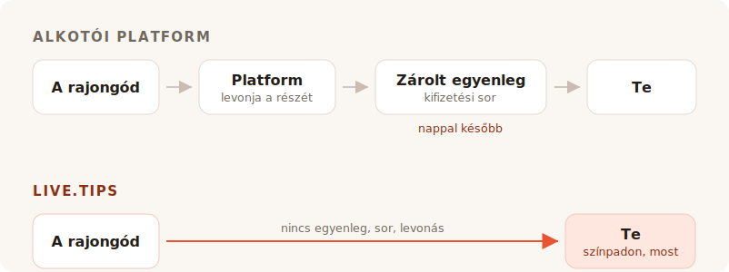

Lejátszod a szettet. Zajos a terem, valaki a pult mellett ráadást kiabál, és
nagyjából nyolc másodpercig mindenki előtted úgy érzi, hogy pénzt adna neked. Aztán
a pillanat bezárul. Beszélgetni kezdenek a barátjukkal, keresik a kabátjukat,
elmennek.

Senkinél sincs készpénz abban a teremben. Így hát nekiállsz borravalós perselyt
keresni, és minden találat, amire bukkansz, azt kéri, hogy legyél alkotó egy saját
oldallal.

## Mire valók ezek az eszközök valójában

A Ko-fi, a Buy Me a Coffee és a Patreon egy olyan rajongó köré épül, aki máshol van,
később. Valaki elolvasta a bejegyzésedet, megnézte a videódat, végigolvasta a
képregényedet — és hetekkel az után, egyedül a telefonjával, úgy dönt, hogy küld
neked öt eurót. Ennek a rajongónak van ideje. Tud fiókot csinálni. El tudja olvasni
a szintjeidet.

Ezeknek a termékeknek minden tulajdonsága ebből az egyetlen feltevésből következik.
A tagságok, a bolt, az exkluzív bejegyzések, a galéria, a Discord-szerepek. Jó
feltevés, és jól is szolgálják ki. Nem szépítjük: ennek a projektnek a saját „fizess
a fejlesztőnek egy kávét" linkje a Buy Me a Coffee-ra visz, és ezt a munkát rendben
elvégzi.

A TipTopJar közelebb van a célhoz — ez borravalós termék, nem alkotói platform, és
QR-kódot nyomtat. De így is azzal kezdi, hogy lefoglal neked egy felhasználónevet,
ellenőrzi a személyazonosságodat, és PayPal Business-fiókot kér.

Ezekkel semmi baj. Csak épp nem színpad.

## A díj az a rész, amin mindenki vitatkozik

Ez egyben az a rész is, ahol az őszinte válasz kevésbé hízelgő ránk nézve, mint azt
a marketing szeretné — úgyhogy csináljuk rendesen.

**A Ko-fi 0%-ot vesz el a borravalóból**, és egyenesen a saját Stripe- vagy
PayPal-fiókodba fizeti. Az ő szavaikkal: *„A Ko-fin közvetlenül kapod meg a pénzt, a
te pénzedet soha nem tartjuk vissza."* Ha tagságokat vagy boltot akarsz az 5%-os
részesedésük nélkül, az a Ko-fi Gold, havi $12-ért. Csak borravalóra a Ko-fi tényleg
ingyenes, és aki azt mondja neked, hogy minden platform lecsíp a borravalódból, az
el akar adni valamit.

**A Buy Me a Coffee mindenből 5%-ot vesz el**, a Stripe saját 2.9% + $0.30-án és egy
további 0.5%-os kifizetési díjon felül. A pénzed aztán egy egyenlegen ül, amelyhez
nem nyúlhatsz, amíg el nem éri a $10-t, és az első kifizetés egy ellenőrzési soron
megy át, ami a súgójuk szerint jellemzően 7 és 14 nap között tart.

**A TipTopJar** minden borravaló után díjat számít fel, amelyet a rajongóddal
fizettet meg a borravalóján felül — a Product Hunt-listázásuk egységes 5%-nak
nevezi, bár a szám sehol nem jelenik meg magán az oldalon. Az ingyenes csomaghoz
**egyszeri $9.99-es beállítási díj** tartozik, és 3–5 munkanap alatt fizet ki; az
aznapi kifizetés havi $9.99-be kerül.

Tehát: az egyik ingyenes a borravalóra, a másik elveszi az estéd tizedét, miután a
fizetésfeldolgozó végzett, a harmadik pedig tíz dollárt számít fel, mielőtt az első
rajongód bármit beszkennelne.

## A nulla százalék nem ugyanaz, mint a semmi

Itt van az a rész, amit a díjtáblázatok mind kihagynak — és ez az oka annak, hogy
egy Ko-fi-borravaló és egy live.tips-borravaló nem ugyanakkora.

Ezek közül minden termék — a Ko-fit is beleértve, és a live.tips is, amikor Stripe-on
fut — egy kártyafeldolgozón viszi át a pénzt, egy kártyafeldolgozó pedig minden
egyes tranzakcióból levon egy százalékot és egy fix összeget. A Ko-fi ezt őszintén
bevallja; az áras oldalukon ott a csillag: *„a fizetésfeldolgozó szokásos díjai
szintén érvényesek."* Az ő 0%-uk valódi 0%. Abból a 0%, amit a Stripe meghagy.

Ez a fix összeg az, ami csendben tönkreteszi a kis borravalókat. A feldolgozó
átalánydíja ugyanannyi egy €2-es borravalón, mint egy €200-on — a borravaló pedig
természeténél fogva kicsi. Egy kártyás borravaló mindig kicsit könnyebben ér földet,
mint ahogy elhajították.

**Egy Revolutos vagy MobilePayes borravalóban egyáltalán nincs feldolgozó.** A
rajongód megnyitja a saját Revolutját, és a `@username`-edre küldi a pénzt; a
Revolutról Revolutra utalások ingyenesek, és másodpercek alatt megérkeznek. Vagy
megnyitja a MobilePayt, és a Boxodba fizet, ami Finnországban ingyenes a €400 alatti
személyes utalásoknál — ezt a küszöböt egyetlen utcazenész borravalója sem fogja
súrolni. Ugyanaz történik, mint amikor valaki visszaadja egy barátjának a sör árát,
mert szó szerint ez is az: személyes utalás két ember között. Nincs kereskedő, nincs
elfogadó bank, nincs százalék, nincs harminc cent.

Egy €5-ös borravaló €5-ként érkezik meg. Nem €5 mínusz a semmi egy szelete, mínusz
egy feldolgozási díj, mínusz egy kifizetési díj. Hanem €5-ként.

Ennek kellene jelentenie azt, hogy „nincs díj", és ezen a két sínen ezt csillag
nélkül mondhatjuk ki. Furcsa következtetés egy díjakról szóló szakasz végén, úgyhogy
mondjuk ki a hallgatólagos részt: a pénz sosem volt az a drága dolog, amit elvesznek
tőled.

## Amit valójában elvesznek, az a terem

Egy online borravalós oldal magánügylet. Annak is kell lennie — a rajongó egyedül
van.

Egy borravaló a színpadon nem magánügy, és épp ez az egész mechanizmus. Amikor a
persely a melletted lévő képernyőn láthatóan megtelik, amikor a célsáv elmozdul,
amikor egy név és egy üzenet landol a kijelzőn, te pedig beleolvasod a mikrofonba,
hogy *köszönöm, Mira* — a terem látja, hogy adás történik. A borravaló megszűnik
szívesség lenni, és azzá válik, amit a terem együtt csinál. Ez nem fizetési funkció.
Ez az oka annak, hogy a készpénzes persely négyszáz éven át működött, és ez az, ami
meghalt, amikor mindenki abbahagyta az érmék hordását.

A Ko-finak vannak stream-értesítései, méghozzá jók — de ezek OBS-overlay-ek, egy
olyan nézőre célozva, aki otthon ül a Twitch előtt. A Buy Me a Coffee-nak semmilyen
élő felülete sincs. A TipTopJar nyomtat neked egy QR-kódot, és mutat egy valós
idejű vezérlőpultot, ami egy képernyő *neked*, nem a teremnek.

Egyikük sem tesz perselyt a közönséged elé.

## Beállítás bepakolás közben

Itt a másik dolog, amit egy online platform valójában nem tud megoldani, mert abból
ered, amik ők maguk.

Ahhoz, hogy Revolutos borravalót fogadj a live.tips-szel, beírod az alkalmazásba a
`@username`-edet. Ahhoz, hogy MobilePayt fogadj, beilleszted a Boxod linkjét. Ennyi
az egész integráció. Nincs fiók, nincs regisztráció, nincs személyazonosság-
ellenőrzés, nincsenek banki adatok, nincs várakozás egy megerősítő e-mailre —
másodpercek, hangpróba közben, állva, a telefonon, amit amúgy is a kezedben tartasz.

A Ko-fi, a Buy Me a Coffee és a TipTopJar ezt nem tudja nyújtani, és nem
lustaságból. Az egész modelljük megköveteli, hogy a fizetésen belül üljenek, és
tudják, hogy megtörtént. Nem ülhetsz benne egy olyan fizetésben, amit két ember
egymásnak intéz, úgyhogy egy platform sosem tudja átnyújtani neked azokat a síneket,
amelyek semmibe sem kerülnek. Azokon kell átvezetnie, amelyek igen.

És pontosan itt kell őszintének lennünk veled. **A live.tips sem tudhatja, hogy
megtörtént.** A Revolutnak és a MobilePaynek nincs módja megerősíteni egy fizetést,
így azok a borravalók a színpadi képernyődön *nem megerősítve* jelöléssel bukkannak
fel: akkor jelennek meg, amikor a rajongó elküldi az űrlapot, akár befejezi a
fizetést, akár nem. A saját banki alkalmazásod alapján egyezteted őket. Ez az ára
annak, hogy senki sem áll középen, és inkább ideírjuk, mint hogy elhallgatnánk.

A kártyás borravaló a megerősített út, és a Stripe-on keresztül fut. Ez egy
Stripe-fiókot jelent a te nevedben — a Stripe elvégzi a saját
személyazonosság-ellenőrzését, ahogy minden szabályozott feldolgozónak kell. Amit
viszont nem jelent, az egy fiók *nálunk*: létrehozol egy korlátozott API-kulcsot,
beilleszted, és az alkalmazás az `api.stripe.com`-mal beszél, mással semmivel. A
pénz teljes útját megírtuk itt: [hogyan bánik a pénzzel a
live.tips](post:how-live-tips-handles-money).

## Minden egy oldalon

| | live.tips | Ko-fi | Buy Me a Coffee | TipTopJar |
| --- | --- | --- | --- | --- |
| **Részesedés a borravalóból** | semmi | semmi | 5% | ~5%, a rajongó borravalójához adva |
| **Feldolgozási díj** | csak a Stripe-é — **egyáltalán semmi** Revolutnál / MobilePaynél | a Stripe-é / PayPalé, mindig | a Stripe-é, + 0.5% kifizetés | a feldolgozóé |
| **Ki tartja a pénzedet** | senki | senki | Buy Me a Coffee | TipTopJar |
| **Mikor kapod meg** | ahogy a borravaló elszámolódik | ahogy a borravaló elszámolódik | $10 után, első kifizetés 7–14 nap | 3–5 munkanap, vagy $9.99/hó az aznapiért |
| **Indulási költség** | ingyenes | ingyenes | ingyenes | $9.99 beállítási díj |
| **Fiók az eszköznél** | semmi | kötelező | kötelező | kötelező, plusz egy személyazonosság-ellenőrzés |
| **Persely, amit lát a közönség** | igen | nem | nem | nem |
| **Revolut / MobilePay** | igen | nem | nem | nem |
| **Nyílt forráskód** | MIT | nem | nem | nem |

A díjak és kifizetési feltételek az egyes szolgáltatások saját oldalain 2026 júliusában közzétett formában, kivéve a TipTopJar százalékát, amely csak a Product Hunt-listázásán szerepel. A Revolutról Revolutra utalások a Revolut szerint ingyenesek; a MobilePay finn személyes utalásai €400 alatt ingyenesek, e fölött 1%-ot vesz el. Az árak változnak; menj, és ellenőrizd őket magad, ahelyett, hogy egy versenytárs szavát vennéd.
{: .footnote }

## Mikor ne használd a live.tips-et

Ha visszatérő tagságokat, boltot a nyomataidnak, exkluzív bejegyzéseket és egy
helyet akarsz, ahol a rajongók a fellépések között megtalálnak, akkor a Ko-fit
akarod, és menj, használd a Ko-fit. Abban jobb változat, mint bármi, amit mi valaha
építeni fogunk, és a borravalóra nem kerül semmibe.

A live.tips nem platform, és nem is próbál azzá válni. Nincs fenntartandó oldal,
nincs lefoglalandó felhasználónév, nincs felhasználási feltétel, amivel bajba
kerülhetnél, nincs felfüggesztésről szóló e-mail este tizenegykor, egy fellépés
előtt. Nincs mit felfüggeszteni. Az alkalmazás a böngésződben fut, a kulcs az
eszközöd kulcstárában lakik, az egész MIT-licenc alatt van a GitHubon, és ha holnap
eltűnnénk, a gitártokodra ragasztott QR-kód továbbra is működne, mert a [saját
Stripe-linkedre](post:one-qr-code-every-payment-method) mutat, nem ránk.

Ez nem ígéret a szándékainkról. Ez annak a leírása, amit építettünk, és el is
olvashatod.

## Próbáld ki, mielőtt megbíznál benne

Nyisd meg az [alkalmazást](/app/?lang=hu), hagyd a Stripe-ot demó módban, és dobj
egy demó borravalót a perselybe. Egy percbe telik, semmibe sem kerül, és nem kell
megmondanod a nevedet hozzá.

Aztán tedd állványra a következő fellépéseden, és figyeld, mit csinál a terem,
amikor látja, ahogy a persely megtelik.
