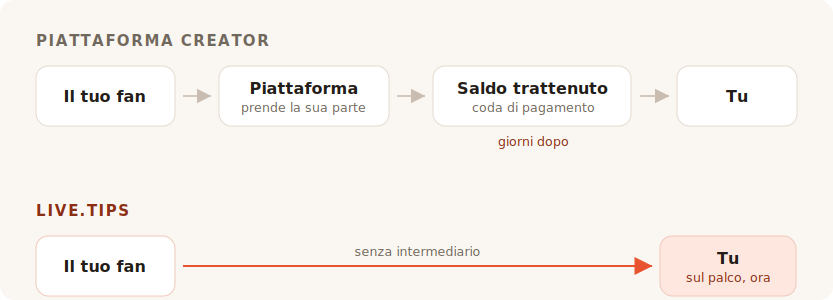

Finisci il set. La sala è rumorosa, qualcuno vicino al bancone ne chiede a gran voce
un'altra, e per circa otto secondi ogni persona davanti a te ha voglia di darti dei
soldi. Poi il momento si chiude. Parlano con l'amico, cercano il cappotto, se ne
vanno.

Nessuno in quella sala ha contanti con sé. Così ti metti a cercare un barattolo
delle mance, e ogni risultato che trovi ti chiede di diventare un creator con una
pagina.

## A cosa servono davvero questi strumenti

Ko-fi, Buy Me a Coffee e Patreon sono costruiti attorno a un fan che è altrove, più
tardi. Qualcuno ha letto il tuo post, guardato il tuo video, finito il tuo fumetto —
e settimane dopo il fatto, da solo con il telefono, decide di mandarti cinque euro.
Quel fan ha tempo. Può crearsi un account. Può leggere i tuoi livelli.

Tutto in quei prodotti discende da quest'unica ipotesi. Gli abbonamenti, il negozio,
i post esclusivi, la galleria, i ruoli su Discord. È una buona ipotesi, e la servono
bene. Non facciamo i timidi: il link «offri un caffè allo sviluppatore» di questo
stesso progetto porta a Buy Me a Coffee, e fa quel lavoro benissimo.

TipTopJar è più vicino al bersaglio — è un prodotto per le mance più che una
piattaforma per creator, e stampa un codice QR. Ma parte comunque col riservarti un
nome utente, verificare la tua identità e chiederti un account PayPal Business.

Niente di tutto ciò è sbagliato. Semplicemente non è un palco.

## La commissione è la parte su cui tutti discutono

È anche la parte in cui la risposta onesta ci è meno lusinghiera di quanto vorrebbe
il marketing, quindi facciamola come si deve.

**Ko-fi prende lo 0% di una mancia**, e la versa direttamente sul tuo Stripe o
PayPal. Parole loro: *«Su Ko-fi vieni pagato direttamente, non tratteniamo mai il
tuo denaro.»* Se vuoi gli abbonamenti o un negozio senza la loro quota del 5%, è
Ko-fi Gold a 12 $ al mese. Sulle sole mance Ko-fi è davvero gratuito, e chiunque ti
dica che ogni piattaforma sgraffigna le tue mance ti sta vendendo qualcosa.

**Buy Me a Coffee prende il 5% di tutto**, oltre al 2,9% + 0,30 $ di Stripe stesso e
a un ulteriore 0,5% di commissione di prelievo. Il tuo denaro resta poi su un saldo
che non puoi toccare finché non raggiunge i 10 $, e il primo prelievo passa per una
coda di revisione che, secondo il loro centro assistenza, richiede di solito dai 7
ai 14 giorni.

**TipTopJar** applica una commissione per mancia che chiede al tuo fan di coprire in
aggiunta alla mancia — la sua scheda su Product Hunt la definisce un 5% fisso, anche
se il numero non compare da nessuna parte sul sito stesso. Il piano gratuito
comporta una **commissione di attivazione una tantum di 9,99 $** e paga in 3-5
giorni lavorativi; i prelievi in giornata costano 9,99 $ al mese.

Quindi: uno è gratuito sulle mance, uno si prende un decimo della tua serata una
volta che il processore ha finito, e uno ti fa pagare dieci dollari prima ancora che
il tuo primo fan abbia scansionato alcunché.

## Zero per cento non è la stessa cosa di niente

Ecco la parte che tutte le tabelle delle commissioni tralasciano, ed è il motivo per
cui una mancia su Ko-fi e una mancia su live.tips non hanno la stessa dimensione.

Ognuno di questi prodotti — Ko-fi compreso, e anche live.tips quando gira su Stripe —
muove il denaro attraverso un processore di carte, e un processore di carte prende
una percentuale e una cifra fissa da ogni singola transazione. Ko-fi è onesto su
questo; la sua pagina dei prezzi porta l'asterisco *«si applicano anche le normali
commissioni del processore di pagamento.»* Il loro 0% è uno 0% vero. È lo 0% di quel
che Stripe lascia.

Quella cifra fissa è ciò che rovina in silenzio le piccole mance. L'addebito fisso
di un processore è lo stesso su una mancia da 2 € e su una da 200 €, e le mance sono
piccole per natura. Una mancia con carta atterra sempre un po' più leggera di quanto
è stata lanciata.

**Una mancia via Revolut o MobilePay non ha dentro alcun processore.** Il tuo fan
apre il suo Revolut e manda denaro al tuo `@username`; i trasferimenti da Revolut a
Revolut sono gratuiti e arrivano in pochi secondi. Oppure apre MobilePay e paga
sulla tua Box, che in Finlandia è gratuita per i trasferimenti personali sotto i
400 € — una soglia che nessuna mancia da artista di strada andrà mai a sfiorare. È
la stessa cosa che succede quando qualcuno restituisce a un amico i soldi di una
birra, perché è letteralmente questo: un trasferimento personale tra due persone.
Nessun esercente, nessun acquirer, nessuna percentuale, nessun trenta centesimi.

Una mancia da 5 € arriva come 5 €. Non come 5 € meno una quota di niente, e meno una
commissione di elaborazione, e meno una commissione di prelievo. Come 5 €.

È questo che «senza commissioni» dovrebbe significare, e su quei due binari possiamo
dirlo senza asterisco. Strana conclusione per una sezione sulle commissioni, quindi
diciamo la parte che si tace: il denaro non è mai stato la cosa costosa che ti
prendono.

## Ciò che davvero ti prendono è la sala

Una pagina di mance online è una transazione privata. Deve esserlo — il fan è solo.

Una mancia sul palco non è privata, ed è tutto lì il meccanismo. Quando il barattolo
sullo schermo accanto a te si riempie a vista d'occhio, quando la barra
dell'obiettivo avanza, quando un nome e un messaggio compaiono sul display e tu li
leggi al microfono e dici *grazie, Mira* — la sala vede che il dare sta accadendo.
La mancia smette di essere un favore e diventa qualcosa che la sala fa insieme. Non
è una funzione di pagamento. È il motivo per cui il barattolo delle monete ha
funzionato per quattrocento anni, ed è la cosa che è morta quando tutti hanno smesso
di portare monete.

Ko-fi ha gli avvisi in diretta, e sono buoni — ma sono un overlay per OBS, rivolto a
uno spettatore seduto a casa davanti a Twitch. Buy Me a Coffee non ha alcuna
superficie dal vivo. TipTopJar ti stamperà un codice QR e ti mostrerà una dashboard
in tempo reale, che è uno schermo per *te*, non per la sala.

Non uno solo di loro metterà un barattolo davanti al tuo pubblico.

## Configurarlo durante il montaggio

Ecco l'altra cosa che una piattaforma online non può davvero risolvere, perché sta a
valle di ciò che sono.

Per accettare una mancia via Revolut con live.tips scrivi il tuo `@username`
nell'app. Per accettare MobilePay incolli il link della tua Box. Ecco tutta
l'integrazione. Nessun account, nessuna registrazione, nessun controllo d'identità,
nessun dato bancario, nessuna attesa di un'email di conferma — pochi secondi,
durante il soundcheck, in piedi, sul telefono che hai già in mano.

Ko-fi, Buy Me a Coffee e TipTopJar non possono offrirlo, e non perché siano pigri.
Tutto il loro modello richiede che si mettano dentro il pagamento e sappiano che è
avvenuto. Non puoi metterti dentro un pagamento che due persone si fanno l'un
l'altra, quindi una piattaforma non potrà mai consegnarti i binari che non costano
niente. È costretta a instradarti su quelli che costano.

Ed è esattamente qui che dobbiamo essere onesti con te. **Neanche live.tips può
sapere che è avvenuto.** Revolut e MobilePay non hanno modo di confermare un
pagamento, così quelle mance compaiono sul tuo schermo di scena contrassegnate come
*non verificate*: appaiono quando il fan invia il modulo, che finisca di pagare o
no. La riconciliazione la fai con la tua app bancaria. È il prezzo di non avere
nessuno in mezzo, e preferiamo stamparlo qui che seppellirlo.

Le mance con carta sono la via verificata, e passano per Stripe. Questo significa un
account Stripe a tuo nome — Stripe fa il proprio controllo d'identità, come deve fare
ogni processore regolamentato. Ciò che non significa è un account con *noi*: crei una
chiave API con permessi limitati, la incolli, e l'app parla con `api.stripe.com` e
con nient'altro. Abbiamo raccontato l'intero percorso del denaro in
[come live.tips gestisce il denaro](post:how-live-tips-handles-money).

## Tutto in una pagina sola

| | live.tips | Ko-fi | Buy Me a Coffee | TipTopJar |
| --- | --- | --- | --- | --- |
| **Quota su una mancia** | nessuna | nessuna | 5% | ~5%, aggiunto alla mancia del fan |
| **Commissione di elaborazione** | quella di Stripe — **nessuna** su Revolut / MobilePay | quella di Stripe / PayPal, sempre | quella di Stripe, + 0,5% di prelievo | quella del processore |
| **Chi trattiene i tuoi soldi** | nessuno | nessuno | Buy Me a Coffee | TipTopJar |
| **Quando li ricevi** | appena la mancia è liquidata | appena la mancia è liquidata | dopo 10 $, primo prelievo in 7–14 giorni | 3–5 giorni lavorativi, o 9,99 $/mese per la giornata |
| **Costo per iniziare** | gratis | gratis | gratis | 9,99 $ di attivazione |
| **Account con lo strumento** | nessuno | obbligatorio | obbligatorio | obbligatorio, più un controllo d'identità |
| **Un barattolo che il pubblico vede** | sì | no | no | no |
| **Revolut / MobilePay** | sì | no | no | no |
| **Open source** | MIT | no | no | no |

Commissioni e condizioni di prelievo come pubblicate sulle pagine di ciascun servizio a luglio 2026, tranne la percentuale di TipTopJar, che compare solo sulla sua scheda di Product Hunt. I trasferimenti da Revolut a Revolut sono gratuiti secondo Revolut; i trasferimenti personali finlandesi di MobilePay sono gratuiti sotto i 400 €, oltre i quali trattiene l'1%. I prezzi cambiano; vai a controllarli tu stesso invece di credere sulla parola a un concorrente.
{: .footnote }

## Quando non dovresti usare live.tips

Se vuoi abbonamenti ricorrenti, un negozio per le tue stampe, post esclusivi e un
posto dove i fan ti ritrovano tra un concerto e l'altro, allora vuoi Ko-fi, e
dovresti andare a usare Ko-fi. È una versione di tutto ciò migliore di qualunque cosa
costruiremo mai, e sulle mance non ti costa niente.

live.tips non è una piattaforma e non cerca di diventarlo. Non c'è una pagina da
mantenere, né un nome utente da riservare, né condizioni d'uso da violare, né
un'email di sospensione da ricevere alle undici di sera prima di un concerto. Non c'è
niente da sospendere. L'app gira nel tuo browser, la chiave vive nel portachiavi del
tuo dispositivo, il tutto è rilasciato con licenza MIT su GitHub, e se domani
sparissimo il codice QR attaccato alla custodia della tua chitarra continuerebbe a
funzionare, perché punta al [tuo link Stripe](post:one-qr-code-every-payment-method),
non a noi.

Questa non è una promessa sulle nostre intenzioni. È una descrizione di ciò che
abbiamo costruito, e puoi andare a leggerla.

## Provalo prima di fidarti

Apri l'[app](/app/?lang=it), lascia Stripe in modalità demo e lancia una mancia di
prova nel barattolo. Ci vuole un minuto, non costa niente, e non devi dirci il tuo
nome per farlo.

Poi mettilo su un supporto al tuo prossimo concerto e guarda cosa fa la sala quando
può vedere il barattolo che si riempie.
