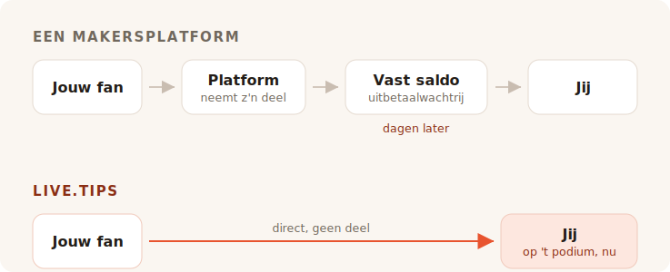

Je speelt je laatste nummer. De zaal is luid, iemand bij de bar roept om een
toegift, en zo'n acht seconden lang heeft iedereen vóór je zin om je geld te
geven. Dan sluit het moment zich. Ze praten met hun vriend, ze zoeken hun jas, ze
vertrekken.

Niemand in die zaal heeft contant geld bij zich. Dus ga je op zoek naar een
fooienpot, en elk resultaat dat je vindt, vraagt je om een maker met een pagina te
worden.

## Waar die tools eigenlijk voor zijn

Ko-fi, Buy Me a Coffee en Patreon zijn gebouwd rond een fan die ergens anders is,
later. Iemand las je bericht, keek je video, las je strip uit — en weken later,
alleen met een telefoon, besluit hij je vijf euro te sturen. Die fan heeft tijd.
Hij kan een account aanmaken. Hij kan je tiers lezen.

Alles aan die producten volgt uit die ene aanname. De lidmaatschappen, de shop, de
exclusieve posts, de galerij, de Discord-rollen. Het is een goede aanname, en ze
bedienen die goed. We doen hier niet flauw: de eigen 'trakteer de ontwikkelaar op
een koffie'-link van dit project gaat naar Buy Me a Coffee, en dat doet hij prima.

TipTopJar zit dichter bij de kern — het is een fooienproduct in plaats van een
makersplatform, en het print een QR-code. Maar het begint nog steeds met het
reserveren van een gebruikersnaam, het verifiëren van je identiteit en het vragen
om een PayPal Business-account.

Niets daarvan is verkeerd. Het is alleen geen podium.

## Over de fee ruziet iedereen

Het is ook het deel waar het eerlijke antwoord minder vleiend voor ons is dan de
marketing zou willen, dus laten we het netjes doen.

**Ko-fi neemt 0% van een fooi** en betaalt die rechtstreeks op je eigen Stripe- of
PayPal-rekening. Hun woorden: *"Bij Ko-fi word je rechtstreeks betaald, wij houden
je geld nooit vast."* Wil je lidmaatschappen of een shop zonder hun 5%-aandeel,
dan is dat Ko-fi Gold voor $12 per maand. Op fooien alleen is Ko-fi echt gratis,
en wie je vertelt dat elk platform van je fooien afroomt, verkoopt je iets.

**Buy Me a Coffee neemt 5% van alles**, bovenop Stripes eigen 2.9% + $0.30 en nog
eens 0.5% uitbetalingskosten. Je geld staat dan in een saldo waar je niet aan kunt
tot het $10 bereikt, en de eerste uitbetaling gaat door een controlewachtrij die
volgens hun helpcentrum meestal 7 tot 14 dagen duurt.

**TipTopJar** rekent een fee per fooi die het je fan laat bijbetalen bovenop zijn
fooi — hun Product Hunt-vermelding noemt het een vaste 5%, al staat het getal
nergens op de site zelf. Het gratis plan draagt een **eenmalige instelkost van
$9.99** en betaalt uit in 3 tot 5 werkdagen; uitbetaling op dezelfde dag kost
$9.99 per maand.

Dus: een van hen is gratis op fooien, een neemt een tiende van je avond zodra de
verwerker klaar is, en een rekent je tien dollar voordat je eerste fan iets heeft
gescand.

## Nul procent is niet hetzelfde als niks

Hier is het deel dat de feetabellen allemaal weglaten, en het is de reden waarom
een Ko-fi-fooi en een live.tips-fooi niet even groot zijn.

Elk van deze producten — Ko-fi inbegrepen, en live.tips ook wanneer het op Stripe
draait — verplaatst geld via een kaartverwerker, en een kaartverwerker neemt bij
elke transactie een percentage en een vast bedrag. Ko-fi is daar eerlijk over; hun
prijspagina draagt het sterretje *"de gebruikelijke kosten van de betaalverwerker
zijn ook van toepassing."* Hun 0% is een echte 0%. Het is 0% van wat Stripe
overlaat.

Dat vaste bedrag is wat stilletjes de kleine fooien ruïneert. Het vaste tarief van
een verwerker is bij een fooi van €2 hetzelfde als bij een van €200, en fooien
zijn van nature klein. Een kaartfooi landt altijd iets lichter dan hij geworpen
werd.

**Een fooi via Revolut of MobilePay heeft er helemaal geen verwerker in.** Je fan
opent zijn eigen Revolut en stuurt geld naar je `@username`;
Revolut-naar-Revolut-overboekingen zijn gratis en landen in seconden. Of hij opent
MobilePay en betaalt in je Box, wat in Finland gratis is voor persoonlijke
overboekingen onder €400 — een drempel waar geen enkele straatmuzikantenfooi aan
komt. Het is hetzelfde als wanneer iemand een vriend een biertje terugbetaalt,
want dat is het letterlijk: een persoonlijke overboeking tussen twee mensen. Geen
handelaar, geen acquirer, geen percentage, geen dertig cent.

Een fooi van €5 komt aan als €5. Niet als €5 min een aandeel van niks, min
verwerkingskosten, min uitbetalingskosten. Als €5.

Dat is wat 'geen kosten' zou moeten betekenen, en op die twee sporen kunnen we het
zonder sterretje zeggen. Een vreemde conclusie voor een feehoofdstuk, dus laten we
het stille deel hardop zeggen: het geld was nooit het dure dat ze nemen.

## Wat ze echt nemen, is de zaal

Een online fooienpagina is een privétransactie. Dat moet wel — de fan is alleen.

Een fooi op het podium is niet privé, en dat is het hele mechanisme. Wanneer de
pot op het scherm naast je zichtbaar vol loopt, wanneer de doelbalk beweegt,
wanneer een naam en een bericht op het display landen en je ze in de microfoon
leest en *bedankt, Mira* zegt — dan ziet de zaal dat er gegeven wordt. Fooi geven
houdt op een gunst te zijn en wordt iets wat de zaal samen doet. Dat is geen
betaalfunctie. Het is de reden waarom de contante pot vierhonderd jaar lang
werkte, en het is wat stierf toen iedereen stopte met muntgeld dragen.

Ko-fi heeft stream alerts, en het zijn goede — maar het is een OBS-overlay,
gericht op een kijker die thuis voor Twitch zit. Buy Me a Coffee heeft helemaal
geen live-vlak. TipTopJar print je een QR-code en toont je een realtime dashboard,
wat een scherm voor *jou* is, niet voor de zaal.

Geen van hen zet een pot voor je publiek neer.

## Opzetten tijdens de opbouw

Hier is het andere wat een online platform niet echt kan oplossen, omdat het
voortkomt uit wat ze zijn.

Om een Revolut-fooi met live.tips aan te nemen, typ je je `@username` in de app.
Om MobilePay aan te nemen, plak je je Box-link. Dat is de hele integratie. Geen
account, geen aanmelding, geen identiteitscontrole, geen bankgegevens, geen
wachten op een bevestigingsmail — seconden, tijdens de soundcheck, staand, op de
telefoon die je toch al in je hand hebt.

Ko-fi, Buy Me a Coffee en TipTopJar kunnen dat niet bieden, en niet omdat ze lui
zijn. Hun hele model vereist dat ze in de betaling zitten en weten dat die
plaatsvond. Je kunt niet in een betaling zitten die twee mensen aan elkaar doen,
dus een platform kan je nooit de sporen aanreiken die niets kosten. Het moet je
routeren via de sporen die dat wel doen.

En precies daar moeten we eerlijk tegen je zijn. **live.tips kan het evenmin
weten.** Revolut en MobilePay hebben geen manier om een betaling te bevestigen,
dus die fooien verschijnen op je podiumscherm gemarkeerd als *onbevestigd*: ze
verschijnen zodra de fan het formulier verstuurt, of hij nu wel of niet betaalt.
Je stemt af tegen je eigen bankapp. Dat is de prijs van niemand in het midden, en
we drukken hem liever hier af dan hem te begraven.

Kaartfooien zijn het bevestigde pad, en ze lopen via Stripe. Dat betekent een
Stripe-account op jouw naam — Stripe doet zijn eigen identiteitscontrole, zoals
elke gereguleerde verwerker moet. Wat het niet betekent, is een account bij *ons*:
je maakt een beperkte API-sleutel aan, plakt hem in, en de app praat met
`api.stripe.com` en nergens anders. We schreven het hele geldpad uit in
[hoe live.tips met geld omgaat](post:how-live-tips-handles-money).

## Alles op één pagina

| | live.tips | Ko-fi | Buy Me a Coffee | TipTopJar |
| --- | --- | --- | --- | --- |
| **Aandeel in een fooi** | geen | geen | 5% | ~5%, bovenop de fooi van de fan |
| **Verwerkingskosten** | die van Stripe — **helemaal geen** bij Revolut / MobilePay | die van Stripe / PayPal, altijd | die van Stripe, + 0.5% uitbetaling | die van de verwerker |
| **Wie je geld vasthoudt** | niemand | niemand | Buy Me a Coffee | TipTopJar |
| **Wanneer je het krijgt** | zodra de fooi rond is | zodra de fooi rond is | na $10, eerste uitbetaling 7–14 dagen | 3–5 werkdagen, of $9.99/mnd voor dezelfde dag |
| **Kosten om te starten** | gratis | gratis | gratis | $9.99 instelkost |
| **Account bij de tool** | geen | vereist | vereist | vereist, plus een ID-controle |
| **Een pot die het publiek kan zien** | ja | nee | nee | nee |
| **Revolut / MobilePay** | ja | nee | nee | nee |
| **Open source** | MIT | nee | nee | nee |

Kosten en uitbetalingsvoorwaarden zoals gepubliceerd op de eigen pagina's van elke dienst in juli 2026, behalve het percentage van TipTopJar, dat alleen op zijn Product Hunt-vermelding staat. Revolut-naar-Revolut-overboekingen zijn gratis volgens Revolut; MobilePays Finse persoonlijke overboekingen zijn gratis onder €400, daarboven neemt het 1%. Prijzen veranderen; ga ze zelf controleren in plaats van een concurrent op zijn woord te geloven.
{: .footnote }

## Wanneer je live.tips niet moet gebruiken

Wil je terugkerende lidmaatschappen, een shop voor je prints, exclusieve posts en
een plek waar fans je tussen optredens kunnen vinden, dan wil je Ko-fi, en dan
moet je Ko-fi gebruiken. Het is een betere versie daarvan dan wat wij ooit zullen
bouwen, en op fooien kost het je niets.

live.tips is geen platform en probeert er ook geen te worden. Er is geen pagina om
te onderhouden, geen gebruikersnaam om te reserveren, geen gebruiksvoorwaarden om
tegen te zondigen, geen schorsingsmail die om elf uur 's avonds vóór een optreden
binnenkomt. Er is niets om te schorsen. De app draait in je browser, de sleutel
zit in de sleutelhanger van je apparaat, het geheel is MIT-gelicentieerd op
GitHub, en als we morgen zouden verdwijnen, bleef de QR-code die op je
gitaarkoffer plakt gewoon werken, omdat hij naar
[je eigen Stripe-link](post:one-qr-code-every-payment-method) wijst, niet naar ons.

Dat is geen belofte over onze bedoelingen. Het is een beschrijving van wat we
gebouwd hebben, en je kunt het gaan nalezen.

## Probeer het voordat je het vertrouwt

Open de [app](/app/?lang=nl), laat Stripe in demomodus en gooi een demofooi in de
pot. Het kost een minuut, het kost niets, en je hoeft ons je naam niet te
vertellen om het te doen.

Zet het daarna bij je volgende optreden op een standaard en kijk wat de zaal doet
wanneer ze de pot vol zien lopen.
