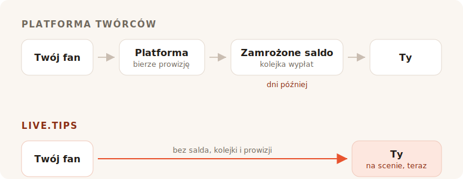

Kończysz set. W sali jest głośno, ktoś przy barze woła o bis, i przez jakieś osiem
sekund każda osoba przed tobą ma ochotę dać ci pieniądze. Potem ta chwila się
zamyka. Zagadują do znajomego, szukają kurtki, wychodzą.

Nikt w tej sali nie ma przy sobie gotówki. Więc szukasz puszki na napiwki, a każdy
wynik, na jaki trafiasz, każe ci zostać twórcą z własną stroną.

## Do czego te narzędzia naprawdę służą

Ko-fi, Buy Me a Coffee i Patreon są zbudowane wokół fana, który jest gdzie indziej
i później. Ktoś przeczytał twój wpis, obejrzał film, doczytał komiks — i wiele
tygodni po fakcie, sam na sam z telefonem, postanawia przesłać ci pięć euro. Ten
fan ma czas. Może założyć konto. Może przeczytać twoje progi.

Wszystko w tych produktach wynika z tego jednego założenia. Subskrypcje, sklep,
wpisy tylko dla wybranych, galeria, role na Discordzie. To dobre założenie i
obsługują je znakomicie. Nie ma co udawać: link „postaw deweloperowi kawę" w tym
projekcie prowadzi do Buy Me a Coffee i robi swoje bez zarzutu.

TipTopJar jest bliżej celu — to produkt do napiwków, a nie platforma dla twórców, i
drukuje kod QR. Ale i tak zaczyna od zarezerwowania ci nazwy użytkownika,
weryfikacji tożsamości i poproszenia o konto PayPal Business.

W tym wszystkim nie ma nic złego. To po prostu nie jest scena.

## Prowizja to ta część, o którą wszyscy się spierają

To też ta część, w której szczera odpowiedź jest dla nas mniej pochlebna, niż
chciałby marketing — więc zróbmy to porządnie.

**Ko-fi pobiera 0% z napiwku** i wypłaca go prosto na twoje własne konto Stripe lub
PayPal. Ich słowa: *„Na Ko-fi dostajesz pieniądze bezpośrednio, nigdy ich nie
przetrzymujemy."* Jeśli chcesz subskrypcji albo sklepu bez ich 5% prowizji, to
Ko-fi Gold za $12 miesięcznie. Na samych napiwkach Ko-fi jest naprawdę darmowe, a
każdy, kto ci wmawia, że wszystkie platformy skubią twoje napiwki, coś ci sprzedaje.

**Buy Me a Coffee pobiera 5% od wszystkiego**, ponad własne 2.9% + $0.30 Stripe'a i
dodatkową opłatę 0.5% za wypłatę. Twoje pieniądze lądują potem na saldzie, którego
nie możesz ruszyć, dopóki nie uzbiera się $10, a pierwsza wypłata przechodzi przez
kolejkę weryfikacyjną, która według ich centrum pomocy trwa zwykle od 7 do 14 dni.

**TipTopJar** pobiera opłatę od każdego napiwku, którą każe pokryć twojemu fanowi
ponad jego napiwek — ich wpis na Product Hunt mówi o równych 5%, choć ta liczba nie
pojawia się nigdzie na samej stronie. Darmowy plan wiąże się z **jednorazową opłatą
konfiguracyjną $9.99** i wypłaca w 3 do 5 dni roboczych; wypłaty tego samego dnia
kosztują $9.99 miesięcznie.

Czyli: jedno jest darmowe przy napiwkach, drugie zabiera dziesiątą część twojego
wieczoru, gdy procesor płatności skończy swoje, a trzecie liczy sobie dziesięć
dolarów, zanim pierwszy fan cokolwiek zeskanuje.

## Zero procent to nie to samo co nic

Oto część, którą wszystkie tabelki z prowizjami pomijają — i to właśnie dlatego
napiwek na Ko-fi i napiwek na live.tips nie są tej samej wielkości.

Każdy z tych produktów — łącznie z Ko-fi, a także live.tips, gdy działa na Stripe —
przepuszcza pieniądze przez operatora kart, a operator kart pobiera procent i stałą
kwotę od każdej pojedynczej transakcji. Ko-fi jest wobec tego uczciwe; na ich
stronie z cennikiem widnieje gwiazdka *„obowiązują też standardowe opłaty operatora
płatności."* Ich 0% to prawdziwe 0%. To 0% z tego, co zostawia Stripe.

To właśnie ta stała kwota po cichu rujnuje małe napiwki. Płaska opłata operatora
jest taka sama przy napiwku €2 co przy €200 — a napiwki są z natury małe. Napiwek
kartą zawsze ląduje odrobinę lżejszy, niż został rzucony.

**W napiwku przez Revolut albo MobilePay nie ma żadnego operatora.** Twój fan
otwiera własnego Revoluta i wysyła pieniądze na twój `@username`; przelewy z
Revoluta na Revoluta są darmowe i docierają w kilka sekund. Albo otwiera MobilePay
i wpłaca na twój Box, co w Finlandii jest darmowe przy przelewach prywatnych
poniżej €400 — próg, którego żaden napiwek ulicznego grajka nie ruszy. To dokładnie
to samo, co dzieje się, gdy ktoś oddaje koledze za piwo, bo dokładnie tym to jest:
prywatnym przelewem między dwiema osobami. Żadnego sprzedawcy, żadnego agenta
rozliczeniowego, żadnego procentu, żadnych trzydziestu centów.

Napiwek €5 dociera jako €5. Nie jako €5 minus prowizja od niczego, minus opłata za
przetworzenie i minus opłata za wypłatę. Jako €5.

To właśnie powinno znaczyć „bez opłat" i na tych dwóch szynach możemy to powiedzieć
bez gwiazdki. Dziwna konkluzja jak na sekcję o prowizjach, więc powiedzmy to, co
zwykle przemilczane: pieniądze nigdy nie były tym najdroższym, co ci zabierają.

## To, co naprawdę zabierają, to sala

Internetowa strona z napiwkami to transakcja prywatna. Musi taka być — fan jest sam.

Napiwek na scenie nie jest prywatny i to jest cały mechanizm. Gdy puszka na ekranie
obok ciebie widocznie się zapełnia, gdy pasek celu drgnie, gdy imię i wiadomość
pojawiają się na wyświetlaczu, a ty odczytujesz je do mikrofonu i mówisz *dzięki,
Mira* — sala widzi, że dawanie się dzieje. Napiwek przestaje być przysługą, a staje
się czymś, co sala robi wspólnie. To nie jest funkcja płatnicza. To powód, dla
którego puszka z gotówką działała przez czterysta lat, i to właśnie umarło, gdy
wszyscy przestali nosić monety.

Ko-fi ma alerty streamowe i to dobre — ale to nakładka OBS, wycelowana w widza
siedzącego w domu przed Twitchem. Buy Me a Coffee nie ma żadnej powierzchni na
żywo. TipTopJar wydrukuje ci kod QR i pokaże pulpit w czasie rzeczywistym, który
jest ekranem dla *ciebie*, nie dla sali.

Żadne z nich nie postawi puszki przed twoją publicznością.

## Konfiguracja w trakcie wnoszenia sprzętu

Oto druga rzecz, której platforma internetowa tak naprawdę nie naprawi, bo wynika
ona z tego, czym te platformy są.

Żeby przyjmować napiwki przez Revolut w live.tips, wpisujesz w aplikacji swój
`@username`. Żeby przyjmować MobilePay, wklejasz link do swojego Boxa. To cała
integracja. Bez konta, bez rejestracji, bez weryfikacji tożsamości, bez danych
bankowych, bez czekania na mail potwierdzający — sekundy, w trakcie próby dźwięku,
na stojąco, na telefonie, który i tak trzymasz w ręce.

Ko-fi, Buy Me a Coffee i TipTopJar nie mogą tego zaoferować, i to nie z lenistwa.
Cały ich model wymaga, żeby siedziały w środku płatności i wiedziały, że się odbyła.
Nie da się siedzieć w środku płatności, którą dwie osoby robią sobie nawzajem, więc
platforma nigdy nie poda ci szyn, które nic nie kosztują. Musi przeprowadzić cię
przez te, które kosztują.

I tu właśnie powinniśmy być z tobą szczerzy. **live.tips też nie może wiedzieć, że
się odbyła.** Revolut i MobilePay nie mają jak potwierdzić płatności, więc te
napiwki pojawiają się na twoim ekranie scenicznym oznaczone jako *niezweryfikowane*:
wyświetlają się, gdy fan wyśle formularz, niezależnie od tego, czy dokończy
płacenie. Rozliczasz je z własną aplikacją bankową. To cena tego, że nikt nie stoi
w środku, i wolimy to tu wydrukować, niż zamieść pod dywan.

Napiwki kartą to ścieżka zweryfikowana i przechodzą przez Stripe. To znaczy konto
Stripe na twoje nazwisko — Stripe robi własną weryfikację tożsamości, jak każdy
regulowany operator musi. Nie znaczy to jednak konta u *nas*: tworzysz ograniczony
klucz API, wklejasz go, a aplikacja rozmawia z `api.stripe.com` i z niczym więcej.
*Możesz* się zalogować, jeśli chcesz, by twoje zespoły i twoja historia podążyły za
tobą na drugie urządzenie — ale nic cię o to nie prosi, a domyślnie pozostajesz
wylogowany. Całą drogę pieniędzy opisaliśmy w
[jak live.tips obchodzi się z pieniędzmi](post:how-live-tips-handles-money).

## Wszystko na jednej stronie

| | live.tips | Ko-fi | Buy Me a Coffee | TipTopJar |
| --- | --- | --- | --- | --- |
| **Prowizja od napiwku** | brak | brak | 5% | ~5%, doliczane do napiwku fana |
| **Opłata za przetworzenie** | tylko Stripe'a — **zerowa** przy Revolut / MobilePay | Stripe'a / PayPala, zawsze | Stripe'a, + 0.5% za wypłatę | operatora |
| **Kto trzyma twoje pieniądze** | nikt | nikt | Buy Me a Coffee | TipTopJar |
| **Kiedy je dostajesz** | gdy napiwek się rozliczy | gdy napiwek się rozliczy | po $10, pierwsza wypłata 7–14 dni | 3–5 dni roboczych albo $9.99/mies. za ten sam dzień |
| **Koszt startu** | za darmo | za darmo | za darmo | opłata konfiguracyjna $9.99 |
| **Konto w narzędziu** | opcjonalne | wymagane | wymagane | wymagane, plus weryfikacja tożsamości |
| **Puszka, którą widzi publiczność** | tak | nie | nie | nie |
| **Revolut / MobilePay** | tak | nie | nie | nie |
| **Otwarty kod** | MIT | nie | nie | nie |

Opłaty i warunki wypłat zgodnie z tym, co poszczególne serwisy publikują na własnych stronach w lipcu 2026, poza procentem TipTopJar, który pojawia się tylko na jego wpisie na Product Hunt. Przelewy z Revoluta na Revoluta są darmowe według Revoluta; fińskie przelewy prywatne w MobilePay są darmowe poniżej €400, powyżej tego progu pobiera 1%. Ceny się zmieniają; sprawdź je sam, zamiast wierzyć na słowo konkurentowi.
{: .footnote }

## Kiedy nie powinieneś używać live.tips

Jeśli chcesz cyklicznych subskrypcji, sklepu z twoimi wydrukami, wpisów tylko dla
wybranych i miejsca, w którym fani znajdą cię między występami, to chcesz Ko-fi i
powinieneś z Ko-fi skorzystać. To lepsza wersja tego wszystkiego niż cokolwiek, co
kiedykolwiek zbudujemy, i nic cię nie kosztuje przy napiwkach.

live.tips nie jest platformą i nie próbuje nią zostać. Nie ma strony do
utrzymywania, nazwy użytkownika do zarezerwowania, regulaminu, z którym możesz
podpaść, ani maila o zawieszeniu konta o jedenastej w nocy przed koncertem. Nie ma
czego zawieszać. Aplikacja działa w twojej przeglądarce, klucz mieszka w pęku kluczy
twojego urządzenia, całość jest na licencji MIT na GitHub, a gdybyśmy jutro
zniknęli, kod QR przyklejony do twojego futerału od gitary działałby dalej, bo
wskazuje na [twój własny link Stripe](post:one-qr-code-every-payment-method), nie na
nas.

To nie obietnica dotycząca naszych intencji. To opis tego, co zbudowaliśmy, i możesz
to sobie przeczytać.

## Wypróbuj, zanim zaufasz

Otwórz [aplikację](/app/?lang=pl), zostaw Stripe w trybie demo i wrzuć próbny
napiwek do puszki. Zajmuje to minutę, nic nie kosztuje i nie musisz podawać nam
swojego imienia, żeby to zrobić.

A potem postaw to na statywie na następnym koncercie i patrz, co robi sala, gdy
widzi, jak puszka się zapełnia.
