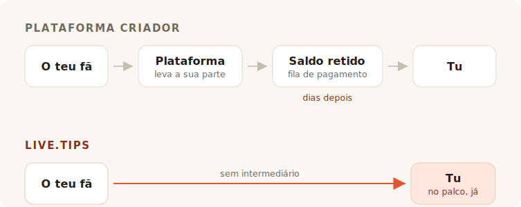

Acabas o concerto. A sala está barulhenta, alguém junto ao balcão grita a pedir mais
uma, e durante uns oito segundos cada pessoa à tua frente sente vontade de te dar
dinheiro. Depois o momento fecha-se. Falam com o amigo, procuram o casaco, vão-se
embora.

Ninguém naquela sala anda com dinheiro vivo. Por isso vais à procura de um pote das
gorjetas, e cada resultado que encontras pede-te para te tornares um criador com uma
página.

## Para que servem realmente essas ferramentas

Ko-fi, Buy Me a Coffee e Patreon estão construídos em torno de um fã que está noutro
lado, mais tarde. Alguém leu a tua publicação, viu o teu vídeo, terminou a tua banda
desenhada — e semanas depois, sozinho com o telemóvel, decide enviar-te cinco euros.
Esse fã tem tempo. Pode criar uma conta. Pode ler os teus níveis.

Tudo nesses produtos decorre dessa única premissa. As subscrições, a loja, as
publicações exclusivas, a galeria, os cargos no Discord. É uma boa premissa, e
servem-na bem. Não vamos armar em tímidos: o próprio link «paga um café ao
programador» deste projeto leva ao Buy Me a Coffee, e faz esse trabalho lindamente.

O TipTopJar acerta mais perto do alvo — é um produto de gorjetas e não uma
plataforma de criadores, e imprime um código QR. Mas mesmo assim começa por te
reservar um nome de utilizador, verificar a tua identidade e pedir-te uma conta
PayPal Business.

Nada disso está errado. Só não é um palco.

## A comissão é a parte sobre a qual todos discutem

É também a parte em que a resposta honesta nos fica menos favorável do que o
marketing gostaria, por isso vamos fazê-la como deve ser.

**O Ko-fi leva 0% de uma gorjeta**, e paga-a diretamente para o teu próprio Stripe
ou PayPal. Nas palavras deles: *«No Ko-fi, recebes diretamente, nunca retemos o teu
dinheiro.»* Se quiseres subscrições ou uma loja sem a comissão de 5% deles, isso é o
Ko-fi Gold por 12 $ ao mês. Só com gorjetas, o Ko-fi é genuinamente gratuito, e quem
te disser que todas as plataformas roubam um bocadinho das tuas gorjetas está a
vender-te alguma coisa.

**O Buy Me a Coffee leva 5% de tudo**, além dos 2,9% + 0,30 $ do próprio Stripe e de
mais uma comissão de levantamento de 0,5%. O teu dinheiro fica então num saldo em
que não podes tocar até chegar aos 10 $, e o primeiro levantamento passa por uma fila
de revisão que, segundo o centro de ajuda deles, costuma demorar 7 a 14 dias.

**O TipTopJar** cobra uma comissão por gorjeta que pede ao teu fã para cobrir por
cima da gorjeta — a sua ficha no Product Hunt descreve-a como uns 5% fixos, embora o
número não apareça em lado nenhum no próprio site. O plano gratuito acarreta uma
**taxa de configuração única de 9,99 $** e paga em 3 a 5 dias úteis; os levantamentos
no próprio dia custam 9,99 $ por mês.

Portanto: um é gratuito nas gorjetas, um fica com um décimo da tua noite assim que o
processador termina, e um cobra-te dez dólares antes de o teu primeiro fã ter sequer
digitalizado o que quer que seja.

## Zero por cento não é o mesmo que nada

Aqui está a parte que todas as tabelas de comissões deixam de fora, e é a razão pela
qual uma gorjeta no Ko-fi e uma gorjeta no live.tips não têm o mesmo tamanho.

Cada um destes produtos — o Ko-fi incluído, e o live.tips também quando corre sobre o
Stripe — move o dinheiro através de um processador de cartões, e um processador de
cartões leva uma percentagem e um valor fixo de cada transação. O Ko-fi é honesto
quanto a isto; a sua página de preços traz o asterisco *«aplicam-se também as
comissões normais do processador de pagamentos.»* O 0% deles é um 0% a sério. É 0% do
que o Stripe deixa.

Esse valor fixo é o que arruína em silêncio as gorjetas pequenas. O encargo fixo de
um processador é o mesmo numa gorjeta de 2 € e numa de 200 €, e as gorjetas são
pequenas por natureza. Uma gorjeta com cartão aterra sempre um pouco mais leve do que
foi atirada.

**Uma gorjeta por Revolut ou MobilePay não tem nenhum processador lá dentro.** O teu
fã abre o seu próprio Revolut e envia dinheiro para o teu `@username`; as
transferências de Revolut para Revolut são gratuitas e chegam em segundos. Ou abre o
MobilePay e paga para a tua Box, o que na Finlândia é gratuito para transferências
pessoais abaixo de 400 € — um limite que nenhuma gorjeta de artista de rua vai
incomodar. É a mesma coisa que acontece quando alguém devolve a um amigo o dinheiro
de uma cerveja, porque é literalmente isso: uma transferência pessoal entre duas
pessoas. Sem comerciante, sem adquirente, sem percentagem, sem trinta cêntimos.

Uma gorjeta de 5 € chega como 5 €. Não como 5 € menos uma comissão de nada, e menos
uma taxa de processamento, e menos uma comissão de levantamento. Como 5 €.

É isto que «sem comissões» devia significar, e nesses dois trilhos podemos dizê-lo
sem asterisco. Estranha conclusão para uma secção sobre comissões, por isso digamos a
parte que se cala: o dinheiro nunca foi a coisa cara que te tiram.

## O que realmente te tiram é a sala

Uma página de gorjetas online é uma transação privada. Tem de ser — o fã está
sozinho.

Uma gorjeta no palco não é privada, e é aí que está todo o mecanismo. Quando o pote
no ecrã ao teu lado se enche à vista, quando a barra do objetivo avança, quando um
nome e uma mensagem surgem no ecrã e tu lê-los ao microfone e dizes *obrigado, Mira*
— a sala vê que dar está a acontecer. A gorjeta deixa de ser um favor e torna-se algo
que a sala faz em conjunto. Isto não é uma funcionalidade de pagamentos. É a razão
pela qual o pote das moedas funcionou durante quatrocentos anos, e é a coisa que
morreu quando toda a gente deixou de andar com moedas.

O Ko-fi tem alertas de direto, e são bons — mas são uma sobreposição de OBS, dirigida
a um espectador sentado em casa à frente do Twitch. O Buy Me a Coffee não tem
qualquer superfície ao vivo. O TipTopJar imprime-te um código QR e mostra-te um
painel em tempo real, que é um ecrã para *ti*, não para a sala.

Nem um só deles põe um pote à frente do teu público.

## Configurar durante a montagem

Aqui está a outra coisa que uma plataforma online não consegue mesmo resolver, porque
é uma consequência daquilo que são.

Para aceitares uma gorjeta por Revolut com o live.tips, escreves o teu `@username` na
app. Para aceitares MobilePay, colas o link da tua Box. É esta toda a integração. Sem
conta, sem registo, sem verificação de identidade, sem dados bancários, sem esperar
por um e-mail de confirmação — segundos, durante a passagem de som, de pé, no
telemóvel que já tens na mão.

O Ko-fi, o Buy Me a Coffee e o TipTopJar não podem oferecer isso, e não por serem
preguiçosos. Todo o modelo deles exige que se coloquem dentro do pagamento e saibam
que ele aconteceu. Não te podes colocar dentro de um pagamento que duas pessoas fazem
uma à outra, por isso uma plataforma nunca te poderá entregar os trilhos que não
custam nada. Tem de te encaminhar pelos que custam.

E é exatamente aqui que devemos ser honestos contigo. **O live.tips também não pode
saber que aconteceu.** O Revolut e o MobilePay não têm forma de confirmar um
pagamento, por isso essas gorjetas aparecem no teu ecrã de palco marcadas como *não
verificadas*: surgem quando o fã envia o formulário, quer acabe de pagar quer não. A
reconciliação fá-la contra a tua própria app bancária. É o preço de não haver ninguém
no meio, e preferimos imprimi-lo aqui do que enterrá-lo.

As gorjetas com cartão são o caminho verificado, e passam pelo Stripe. Isso significa
uma conta Stripe em teu nome — o Stripe faz a sua própria verificação de identidade,
como qualquer processador regulado tem de fazer. O que não significa é uma conta
connosco: crias uma chave de API restrita, colas-la, e a app fala com
`api.stripe.com` e com mais nada. Escrevemos todo o percurso do dinheiro em
[como o live.tips lida com o dinheiro](post:how-live-tips-handles-money).

## Tudo numa página só

| | live.tips | Ko-fi | Buy Me a Coffee | TipTopJar |
| --- | --- | --- | --- | --- |
| **Corte de uma gorjeta** | nenhum | nenhum | 5% | ~5%, somados à gorjeta do fã |
| **Taxa de processamento** | a do Stripe — **nenhuma** no Revolut / MobilePay | a do Stripe / PayPal, sempre | a do Stripe, + 0,5% de levantamento | a do processador |
| **Quem retém o teu dinheiro** | ninguém | ninguém | Buy Me a Coffee | TipTopJar |
| **Quando o recebes** | assim que a gorjeta é liquidada | assim que a gorjeta é liquidada | após 10 $, primeiro levantamento em 7–14 dias | 3–5 dias úteis, ou 9,99 $/mês para o próprio dia |
| **Custo para começar** | grátis | grátis | grátis | 9,99 $ de configuração |
| **Conta com a ferramenta** | nenhuma | obrigatória | obrigatória | obrigatória, mais verificação de identidade |
| **Um pote que o público vê** | sim | não | não | não |
| **Revolut / MobilePay** | sim | não | não | não |
| **Código aberto** | MIT | não | não | não |

Comissões e condições de levantamento tal como publicadas nas páginas de cada serviço em julho de 2026, exceto a percentagem do TipTopJar, que só aparece na sua ficha do Product Hunt. As transferências de Revolut para Revolut são gratuitas segundo a Revolut; as transferências pessoais finlandesas do MobilePay são gratuitas abaixo de 400 €, acima dos quais cobra 1%. Os preços mudam; vai verificá-los tu mesmo em vez de acreditares na palavra de um concorrente.
{: .footnote }

## Quando não deves usar o live.tips

Se queres subscrições recorrentes, uma loja para as tuas gravuras, publicações
exclusivas e um sítio onde os fãs te encontrem entre concertos, então o que queres é
o Ko-fi, e devias ir usar o Ko-fi. É uma versão disso melhor do que qualquer coisa
que alguma vez venhamos a construir, e não te custa nada nas gorjetas.

O live.tips não é uma plataforma e não está a tentar tornar-se uma. Não há página
para manter, nem nome de utilizador para reservar, nem termos de serviço a infringir,
nem e-mail de suspensão a receber às onze da noite antes de um concerto. Não há nada
para suspender. A app corre no teu navegador, a chave vive no porta-chaves do teu
dispositivo, o conjunto todo tem licença MIT no GitHub, e se desaparecêssemos amanhã o
código QR colado ao estojo da tua guitarra continuaria a funcionar, porque aponta
para o [teu próprio link Stripe](post:one-qr-code-every-payment-method), não para nós.

Isto não é uma promessa sobre as nossas intenções. É uma descrição do que
construímos, e podes ir lê-la.

## Experimenta antes de confiar

Abre a [app](/app/?lang=pt), deixa o Stripe em modo demo, e atira uma gorjeta de
demonstração para o pote. Demora um minuto, não custa nada, e não tens de nos dizer o
teu nome para o fazer.

Depois põe-na num suporte no teu próximo concerto e observa o que a sala faz quando
consegue ver o pote a encher-se.
