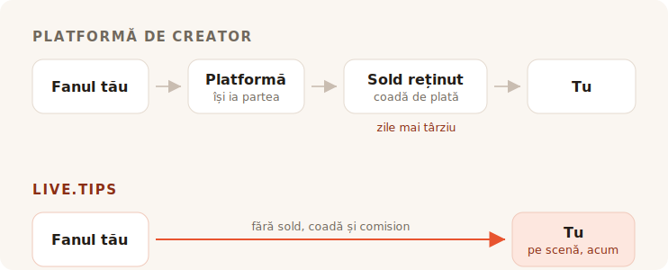

Termini setul. E gălăgie în sală, cineva de lângă bar strigă după un bis și, vreme
de vreo opt secunde, fiecare om din fața ta simte că vrea să-ți dea bani. Apoi
clipa se închide. Vorbesc cu prietenul, își caută haina, pleacă.

Nimeni în sala aia nu are numerar la el. Așa că te apuci să cauți o cutie de
bacșiș, și fiecare rezultat pe care-l găsești îți cere să devii un creator cu o
pagină.

## La ce folosesc de fapt uneltele astea

Ko-fi, Buy Me a Coffee și Patreon sunt construite în jurul unui fan care e în altă
parte, mai târziu. Cineva ți-a citit postarea, ți-a văzut clipul, ți-a terminat
banda desenată — și, la săptămâni după aceea, singur cu telefonul, decide să-ți
trimită cinci euro. Fanul ăsta are timp. Poate să-și facă un cont. Poate să-ți
citească pragurile.

Totul la produsele astea decurge din acea singură presupunere. Abonamentele,
magazinul, postările exclusive, galeria, rolurile de Discord. E o presupunere bună
și o servesc bine. Nu ne prefacem: linkul „fă-i cinste dezvoltatorului cu o cafea"
al acestui proiect duce la Buy Me a Coffee și își face treaba bine.

TipTopJar e mai aproape de țintă — e un produs de bacșiș, nu o platformă pentru
creatori, și tipărește un cod QR. Dar tot începe prin a-ți rezerva un nume de
utilizator, a-ți verifica identitatea și a-ți cere un cont PayPal Business.

Nimic din toate astea nu e greșit. Doar că nu e o scenă.

## Comisionul e partea despre care se ceartă toți

E totodată partea în care răspunsul cinstit e mai puțin măgulitor pentru noi decât
ar vrea marketingul — așa că hai s-o facem cum trebuie.

**Ko-fi ia 0% dintr-un bacșiș** și îl varsă direct în propriul tău Stripe sau
PayPal. Cuvintele lor: *„Pe Ko-fi ești plătit direct, banii tăi nu-i ținem
niciodată."* Dacă vrei abonamente sau un magazin fără comisionul lor de 5%, asta e
Ko-fi Gold, la $12 pe lună. Doar pe bacșișuri, Ko-fi e cu adevărat gratuit, și
oricine îți spune că orice platformă îți ciupește din bacșișuri îți vinde ceva.

**Buy Me a Coffee ia 5% din tot**, peste cei 2.9% + $0.30 ai Stripe și încă un
comision de retragere de 0.5%. Banii tăi stau apoi pe un sold de care nu te poți
atinge până nu ajunge la $10, iar prima retragere trece printr-o coadă de
verificare care, potrivit centrului lor de ajutor, durează de obicei între 7 și 14
zile.

**TipTopJar** percepe un comision pe fiecare bacșiș pe care i-l cere fanului tău
să-l acopere peste bacșișul lui — anunțul lor de pe Product Hunt îl numește un 5%
fix, deși cifra nu apare nicăieri pe site-ul propriu-zis. Planul gratuit vine cu o
**taxă unică de configurare de $9.99** și plătește în 3 până la 5 zile lucrătoare;
retragerile în aceeași zi costă $9.99 pe lună.

Așadar: unul e gratuit la bacșișuri, altul ia o zecime din seara ta după ce termină
procesatorul, iar al treilea îți percepe zece dolari înainte ca primul tău fan să
fi scanat ceva.

## Zero la sută nu e totuna cu nimic

Iată partea pe care toate tabelele de comisioane o lasă pe dinafară — și e motivul
pentru care un bacșiș pe Ko-fi și un bacșiș pe live.tips nu au aceeași mărime.

Fiecare dintre produsele astea — inclusiv Ko-fi, și live.tips la fel, când rulează
pe Stripe — trece banii printr-un procesator de carduri, iar un procesator de
carduri ia un procent și o sumă fixă din fiecare tranzacție în parte. Ko-fi e
cinstit în privința asta; pagina lor de prețuri poartă asteriscul *„se aplică și
comisioanele obișnuite ale procesatorului de plăți."* Cei 0% ai lor sunt un 0%
real. E 0% din ce lasă Stripe.

Suma fixă e cea care, pe tăcute, distruge bacșișurile mici. Taxa fixă a unui
procesator e aceeași la un bacșiș de €2 ca la unul de €200 — iar bacșișurile sunt
mici prin natura lor. Un bacșiș cu cardul ajunge mereu puțin mai ușor decât a fost
aruncat.

**Un bacșiș prin Revolut sau MobilePay n-are niciun procesator în el.** Fanul tău
își deschide propriul Revolut și trimite banii către `@username`-ul tău;
transferurile de la Revolut la Revolut sunt gratuite și ajung în câteva secunde.
Sau deschide MobilePay și plătește în Box-ul tău, care în Finlanda e gratuit pentru
transferurile personale sub €400 — un prag pe care niciun bacșiș de muzicant de
stradă n-o să-l tulbure. E același lucru care se întâmplă când cineva îi dă unui
prieten banii înapoi pentru o bere, pentru că exact asta e: un transfer personal
între doi oameni. Fără comerciant, fără achizitor, fără procent, fără treizeci de
cenți.

Un bacșiș de €5 ajunge ca €5. Nu ca €5 minus un procent din nimic, minus un comision
de procesare și minus un comision de retragere. Ca €5.

Asta ar trebui să însemne „fără comisioane", și pe aceste două șine o putem spune
fără asterisc. Ciudată concluzie pentru o secțiune despre comisioane, așa că hai să
spunem partea nerostită: banii n-au fost niciodată lucrul scump pe care ți-l iau.

## Ce-ți iau ei de fapt e sala

O pagină de bacșiș online e o tranzacție privată. Trebuie să fie — fanul e singur.

Un bacșiș pe scenă nu e privat, și în asta stă tot mecanismul. Când cutia de pe
ecranul de lângă tine se umple vizibil, când bara de obiectiv se mișcă, când un
nume și un mesaj aterizează pe afișaj și tu le citești în microfon și spui
*mulțumesc, Mira* — sala vede că se dăruiește. Bacșișul încetează să fie o favoare
și devine ceva ce sala face împreună. Asta nu e o funcție de plată. E motivul
pentru care cutia cu numerar a funcționat vreme de patru sute de ani, și e lucrul
care a murit când toată lumea a încetat să mai poarte monede.

Ko-fi are alerte de stream, și sunt unele bune — dar sunt un overlay OBS, țintit
către un privitor care stă acasă în fața Twitch. Buy Me a Coffee n-are nicio
suprafață live. TipTopJar îți va tipări un cod QR și îți va arăta un panou în timp
real, care e un ecran pentru *tine*, nu pentru sală.

Niciunul dintre ele nu-ți va pune o cutie în fața publicului.

## Configurare în timpul montării

Iată celălalt lucru pe care o platformă online chiar nu-l poate rezolva, pentru că
vine din chiar ceea ce sunt ele.

Ca să primești un bacșiș prin Revolut cu live.tips, îți scrii `@username`-ul în
aplicație. Ca să primești MobilePay, lipești linkul Box-ului tău. Asta e toată
integrarea. Fără cont, fără înscriere, fără verificare de identitate, fără date
bancare, fără așteptat un e-mail de confirmare — secunde, în timpul probei de sunet,
în picioare, pe telefonul pe care oricum îl ai deja în mână.

Ko-fi, Buy Me a Coffee și TipTopJar nu pot oferi asta, și nu din lene. Întregul lor
model le cere să stea în interiorul plății și să știe că a avut loc. Nu poți sta în
interiorul unei plăți pe care și-o fac doi oameni unul altuia, așa că o platformă
nu-ți poate întinde niciodată șinele care nu costă nimic. Trebuie să te ruteze prin
cele care costă.

Și exact aici ar trebui să fim cinstiți cu tine. **Nici live.tips nu poate ști că a
avut loc.** Revolut și MobilePay n-au cum să confirme o plată, așa că bacșișurile
alea apar pe ecranul tău de scenă marcate ca *neverificate*: apar când fanul trimite
formularul, indiferent dacă termină sau nu de plătit. Le reconciliezi după propria
aplicație bancară. Ăsta e prețul faptului că nu stă nimeni la mijloc, și mai
degrabă îl tipărim aici decât să-l îngropăm.

Bacșișurile cu cardul sunt calea verificată și trec prin Stripe. Asta înseamnă un
cont Stripe pe numele tău — Stripe își face propria verificare de identitate, așa
cum orice procesator reglementat trebuie. Ce nu înseamnă e un cont la *noi*: creezi
o cheie API restricționată, o lipești, iar aplicația vorbește cu `api.stripe.com` și
cu nimic altceva. Am descris tot drumul banilor în [cum se descurcă live.tips cu
banii](post:how-live-tips-handles-money).

## Totul pe o singură pagină

| | live.tips | Ko-fi | Buy Me a Coffee | TipTopJar |
| --- | --- | --- | --- | --- |
| **Comision din bacșiș** | niciunul | niciunul | 5% | ~5%, adăugat la bacșișul fanului |
| **Comision de procesare** | doar al Stripe — **absolut niciunul** la Revolut / MobilePay | al Stripe / PayPal, mereu | al Stripe, + 0.5% la retragere | al procesatorului |
| **Cine îți ține banii** | nimeni | nimeni | Buy Me a Coffee | TipTopJar |
| **Când îi primești** | pe măsură ce bacșișul se decontează | pe măsură ce bacșișul se decontează | după $10, prima retragere în 7–14 zile | 3–5 zile lucrătoare, sau $9.99/lună pentru aceeași zi |
| **Cost de pornire** | gratuit | gratuit | gratuit | taxă de configurare $9.99 |
| **Cont la unealtă** | niciunul | necesar | necesar | necesar, plus o verificare de identitate |
| **O cutie pe care publicul o vede** | da | nu | nu | nu |
| **Revolut / MobilePay** | da | nu | nu | nu |
| **Sursă deschisă** | MIT | nu | nu | nu |

Comisioanele și condițiile de retragere așa cum sunt publicate pe paginile proprii ale fiecărui serviciu în iulie 2026, cu excepția procentului TipTopJar, care apare doar pe anunțul său de pe Product Hunt. Transferurile de la Revolut la Revolut sunt gratuite potrivit Revolut; transferurile personale finlandeze din MobilePay sunt gratuite sub €400, peste care ia 1%. Prețurile se schimbă; du-te și verifică-le singur, în loc să crezi pe cuvânt un concurent.
{: .footnote }

## Când n-ar trebui să folosești live.tips

Dacă vrei abonamente recurente, un magazin pentru printurile tale, postări exclusive
și un loc unde fanii te pot găsi între spectacole, atunci vrei Ko-fi și ar trebui să
te duci să folosești Ko-fi. E o versiune mai bună a acestui lucru decât orice vom
construi noi vreodată, și nu te costă nimic la bacșișuri.

live.tips nu e o platformă și nici nu încearcă să devină una. Nu e nicio pagină de
întreținut, niciun nume de utilizator de rezervat, niciun termen de utilizare cu
care s-o pățești, niciun e-mail de suspendare primit la unsprezece noaptea înainte
de un concert. Nu e nimic de suspendat. Aplicația rulează în browserul tău, cheia
locuiește în brelocul de chei al dispozitivului tău, tot ce e aici e sub licență
MIT pe GitHub, iar dacă am dispărea mâine, codul QR lipit pe tocul tău de chitară ar
continua să funcționeze, pentru că indică spre [propriul tău link
Stripe](post:one-qr-code-every-payment-method), nu spre noi.

Asta nu e o promisiune despre intențiile noastre. E o descriere a ceea ce am
construit, și te poți duce s-o citești.

## Încearcă-l înainte să te încrezi în el

Deschide [aplicația](/app/?lang=ro), lasă Stripe în modul demo și aruncă un bacșiș
demo în cutie. Durează un minut, nu costă nimic și nu trebuie să ne spui numele tău
ca s-o faci.

Apoi pune-o pe un stativ la următorul tău concert și uită-te ce face sala când poate
vedea cutia umplându-se.
