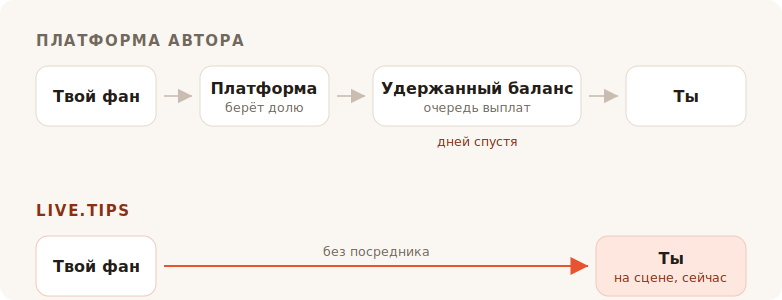

Ты доиграл сет. В зале шумно, кто-то у бара кричит «ещё одну», и секунд восемь
каждый, кто стоит перед тобой, хочет дать тебе денег. Потом момент гаснет. Люди
возвращаются к разговору с друзьями, ищут свою куртку, уходят.

Наличных в том зале нет ни у кого. И вот ты идёшь искать банку для чаевых — и
каждый результат поиска просит тебя стать автором со страницей.

## Для чего эти инструменты на самом деле

Ko-fi, Buy Me a Coffee и Patreon построены вокруг фаната, который где-то в другом
месте и позже. Кто-то прочитал твой пост, посмотрел твоё видео, дочитал твой
комикс — и спустя недели, наедине с телефоном, решает прислать тебе пять евро. У
этого фаната есть время. Он может завести аккаунт. Он может почитать про твои
уровни подписки.

Всё в этих продуктах вытекает из одного допущения. Подписки, магазин,
эксклюзивные посты, галерея, роли в Discord. Допущение верное, и они обслуживают
его хорошо. Мы тут не лукавим: ссылка «купи разработчику кофе» в самом этом
проекте ведёт на Buy Me a Coffee, и со своей задачей она справляется прекрасно.

TipTopJar ближе к сути — это продукт для чаевых, а не платформа для авторов, и он
печатает QR-код. Но и он начинает с того, что резервирует тебе имя пользователя,
проверяет твою личность и просит аккаунт PayPal Business.

Ничего плохого в этом нет. Просто это не сцена.

## Комиссия — это то, о чём все спорят

Это ещё и та часть, где честный ответ менее лестен для нас, чем хотелось бы
маркетингу, — так что сделаем это как следует.

**Ko-fi берёт 0% с чаевых** и переводит их прямо на твой собственный Stripe или
PayPal. Их слова: *«На Ko-fi тебе платят напрямую, мы никогда не держим твои
деньги.»* Если хочешь подписки или магазин без их 5% комиссии — это Ko-fi Gold за
$12 в месяц. Чисто на чаевых Ko-fi действительно бесплатен, и всякий, кто говорит
тебе, что все платформы снимают долю с чаевых, что-то тебе продаёт.

**Buy Me a Coffee берёт 5% со всего** — поверх собственных Stripe 2.9% + $0.30 и
ещё 0.5% комиссии за выплату. Дальше твои деньги лежат на балансе, к которому ты
не можешь прикоснуться, пока он не достигнет $10, а первая выплата проходит через
очередь на проверку, которая, по их справочному центру, обычно занимает от 7 до
14 дней.

**TipTopJar** берёт комиссию с каждых чаевых, которую просит покрыть твоего
фаната поверх его чаевых — листинг на Product Hunt называет это фиксированными 5%,
хотя нигде на самом сайте этой цифры нет. Бесплатный план несёт **единоразовую
плату за настройку $9.99** и выплачивает за 3–5 рабочих дней; выплаты в тот же
день стоят $9.99 в месяц.

Итак: один бесплатен на чаевых, второй берёт десятую часть твоего вечера после
того, как своё забрал процессинг, а третий снимает с тебя десять долларов ещё до
того, как первый фанат хоть что-то отсканировал.

## Ноль процентов — это не то же самое, что ничего

Вот часть, которую все таблицы комиссий обходят, и именно из-за неё чаевые на
Ko-fi и чаевые на live.tips — разного размера.

Каждый из этих продуктов — и Ko-fi в том числе, и live.tips тоже, когда работает
на Stripe — проводит деньги через карточный процессинг, а карточный процессинг
берёт процент и фиксированную сумму с каждой без исключения транзакции. Ko-fi
насчёт этого честен; на их странице с ценами стоит звёздочка *«обычные комиссии
платёжного процессора тоже применяются.»* Их 0% — это настоящие 0%. Это 0% от
того, что оставляет Stripe.

Именно эта фиксированная сумма тихо губит мелкие чаевые. Фиксированный сбор
процессора одинаков и на чаевые €2, и на €200, а чаевые по природе мелкие. Чаевые
картой всегда приземляются чуть легче, чем их бросили.

**В чаевых через Revolut или MobilePay процессора нет вообще.** Твой фанат
открывает свой собственный Revolut и отправляет деньги на твой `@username`;
переводы Revolut-to-Revolut бесплатны и доходят за секунды. Или он открывает
MobilePay и платит в твой Box, что в Финляндии бесплатно для личных переводов до
€400 — порог, который чаевым ни одного уличного музыканта не потревожить. Это то
же самое, что происходит, когда кто-то возвращает другу долг за пиво, потому что
буквально этим оно и является: личный перевод между двумя людьми. Ни продавца, ни
эквайера, ни процента, ни тридцати центов.

Чаевые в €5 доходят как €5. Не как €5 минус доля от ничего, и минус комиссия за
процессинг, и минус комиссия за выплату. Как €5.

Вот что должно означать «без комиссий», и на этих двух рельсах мы можем сказать
это без звёздочки. Странный вывод для раздела о комиссиях, так что скажем то, что
обычно умалчивают: деньги никогда не были самым дорогим, что они забирают.

## На самом деле они забирают зал

Онлайн-страница для чаевых — это приватная транзакция. Иначе и быть не может —
фанат наедине с собой.

Чаевые на сцене не приватны, и в этом весь механизм. Когда банка на экране рядом с
тобой наглядно наполняется, когда сдвигается полоса цели, когда на дисплей падает
имя и сообщение, а ты читаешь его в микрофон и говоришь *спасибо, Мира* — зал
видит, что дарение происходит. Чаевые перестают быть услугой и становятся тем,
что зал делает вместе. Это не платёжная функция. Это причина, по которой наличная
банка работала четыреста лет, и именно это умерло, когда все перестали носить
монеты.

У Ko-fi есть стрим-оповещения, и неплохие — но это OBS-оверлей, нацеленный на
зрителя, который сидит дома перед Twitch. У Buy Me a Coffee живой поверхности нет
вообще. TipTopJar напечатает тебе QR-код и покажет панель в реальном времени — но
это экран для *тебя*, а не для зала.

Ни один из них не поставит банку перед твоей публикой.

## Настроить, пока заносишь аппаратуру

Вот ещё одно, что онлайн-платформа на самом деле не может исправить, потому что
это следствие того, чем она является.

Чтобы принимать чаевые Revolut через live.tips, ты вписываешь свой `@username` в
приложение. Чтобы принимать MobilePay — вставляешь ссылку на свой Box. Вот и вся
интеграция. Ни аккаунта, ни регистрации, ни проверки личности, ни банковских
реквизитов, ни ожидания письма с подтверждением — секунды, во время саундчека,
стоя, на телефоне, который уже у тебя в руке.

Ko-fi, Buy Me a Coffee и TipTopJar такого предложить не могут, и не потому, что
ленятся. Вся их модель требует сидеть внутри платежа и знать, что он состоялся. А
сидеть внутри платежа, который двое людей делают друг другу, невозможно — так что
платформа никогда не даст тебе рельсы, которые ничего не стоят. Ей приходится
вести тебя теми, что стоят.

И вот именно здесь мы должны быть с тобой честны. **live.tips тоже не может знать,
что это случилось.** У Revolut и MobilePay нет способа подтвердить платёж, так что
эти чаевые появляются на твоём сценическом экране с пометкой *неподтверждённые*:
они возникают, как только фанат отправляет форму, — независимо от того, доплатил
он или нет. Ты сверяешь их со своим банковским приложением. Это цена того, что
посередине никто не стоит, и мы скорее напечатаем это здесь, чем спрячем.

Чаевые картой — это подтверждённый путь, и они идут через Stripe. Это значит
аккаунт Stripe на твоё имя — Stripe делает собственную проверку личности, как и
обязан любой регулируемый процессор. Чего это не значит — так это аккаунта у
*нас*: ты создаёшь ограниченный API-ключ, вставляешь его, и приложение общается с
`api.stripe.com` и больше ни с кем. Весь путь денег мы расписали в [как live.tips
обращается с деньгами](post:how-live-tips-handles-money).

## Всё на одной странице

| | live.tips | Ko-fi | Buy Me a Coffee | TipTopJar |
| --- | --- | --- | --- | --- |
| **Доля с чаевых** | нет | нет | 5% | ~5%, добавляется к чаевым фаната |
| **Комиссия за процессинг** | собственная Stripe — **вообще никакой** на Revolut / MobilePay | Stripe / PayPal, всегда | Stripe, + 0.5% за выплату | собственная процессора |
| **Кто держит твои деньги** | никто | никто | Buy Me a Coffee | TipTopJar |
| **Когда ты их получаешь** | как только чаевые проходят | как только чаевые проходят | после $10, первая выплата 7–14 дней | 3–5 рабочих дней, или $9.99/мес за тот же день |
| **Стоимость старта** | бесплатно | бесплатно | бесплатно | $9.99 за настройку |
| **Аккаунт в сервисе** | не нужен | обязателен | обязателен | обязателен, плюс проверка личности |
| **Банка, которую видит публика** | да | нет | нет | нет |
| **Revolut / MobilePay** | да | нет | нет | нет |
| **Открытый код** | MIT | нет | нет | нет |

Комиссии и условия выплат — как опубликовано на собственных страницах каждого сервиса в июле 2026, кроме процента TipTopJar, который фигурирует только в его листинге на Product Hunt. Переводы Revolut-to-Revolut бесплатны по данным Revolut; финские личные переводы MobilePay бесплатны до €400, свыше этой суммы он берёт 1%. Цены меняются; иди и проверь их сам, а не верь на слово конкуренту.
{: .footnote }

## Когда live.tips использовать не стоит

Если тебе нужны регулярные подписки, магазин для твоих принтов, эксклюзивные посты
и место, где фанаты найдут тебя между выступлениями, то тебе нужен Ko-fi, и иди
пользуйся Ko-fi. Это лучшая версия такого, чем всё, что мы когда-либо построим, и
на чаевых она не стоит тебе ничего.

live.tips — не платформа и не пытается ею стать. Нет страницы, которую надо вести,
нет имени пользователя, которое надо резервировать, нет условий сервиса, которые
можно нарушить, нет письма о блокировке в одиннадцать вечера перед выступлением.
Нечего блокировать. Приложение работает в твоём браузере, ключ живёт в хранилище
ключей твоего устройства, вся штука под лицензией MIT на GitHub, и если бы мы
исчезли завтра, QR-код, приклеенный к твоему гитарному кофру, продолжал бы
работать, потому что он указывает на [твою собственную ссылку
Stripe](post:one-qr-code-every-payment-method), а не на нас.

Это не обещание о наших намерениях. Это описание того, что мы построили, и ты
можешь пойти и прочитать его.

## Попробуй, прежде чем доверять

Открой [приложение](/app/?lang=ru), оставь Stripe в демо-режиме и брось
демо-чаевые в банку. Это займёт минуту, стоит ничего, и чтобы это сделать, тебе не
нужно называть нам своё имя.

А потом поставь это на стойку на своём следующем выступлении и посмотри, что
делает зал, когда видит, как банка наполняется.
