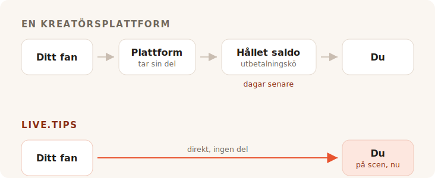

Du spelar klart. Lokalen är högljudd, någon nära baren ropar efter ett
extranummer, och i ungefär åtta sekunder känner varje människa framför dig att den
vill ge dig pengar. Sedan sluts stunden. De pratar med sin kompis, de letar efter
jackan, de går.

Ingen i den lokalen har kontanter på sig. Så du letar efter en dricksburk, och
varje träff du hittar ber dig att bli en kreatör med en sida.

## Vad de där verktygen egentligen är till för

Ko-fi, Buy Me a Coffee och Patreon är byggda kring ett fan som är någon
annanstans, senare. Någon läste ditt inlägg, såg din video, läste klart din serie
— och veckor efteråt, ensam med en telefon, bestämmer sig för att skicka dig fem
euro. Ett sånt fan har tid. Det kan skapa ett konto. Det kan läsa dina nivåer.

Allt med de där produkterna följer av det enda antagandet. Medlemskapen, butiken,
de exklusiva inläggen, galleriet, Discord-rollerna. Det är ett bra antagande, och
de betjänar det väl. Vi spelar inte pryda här: det här projektets egen ”bjud
utvecklaren på en kaffe"-länk går till Buy Me a Coffee, och det jobbet sköter den
fint.

TipTopJar träffar närmare — det är en dricksprodukt snarare än en
kreatörsplattform, och det skriver ut en QR-kod. Men det börjar ändå med att
reservera ett användarnamn åt dig, verifiera din identitet och be om ett PayPal
Business-konto.

Inget av det är fel. Det är bara ingen scen.

## Avgiften är det alla bråkar om

Det är också den del där det ärliga svaret är mindre smickrande för oss än
marknadsföringen skulle vilja, så låt oss göra det ordentligt.

**Ko-fi tar 0% av en dricks** och betalar in den rakt på ditt eget Stripe- eller
PayPal-konto. Deras ord: *”På Ko-fi får du betalt direkt, vi håller aldrig dina
pengar."* Vill du ha medlemskap eller en butik utan deras 5%-andel är det Ko-fi
Gold för $12 i månaden. På enbart dricks är Ko-fi verkligen gratis, och den som
säger att varje plattform skummar dina dricks vill sälja dig något.

**Buy Me a Coffee tar 5% av allt**, ovanpå Stripes egna 2.9% + $0.30 och
ytterligare 0.5% i utbetalningsavgift. Dina pengar ligger sedan i ett saldo du
inte kommer åt förrän det når $10, och den första utbetalningen går genom en
granskningskö som enligt deras hjälpcenter oftast tar 7 till 14 dagar.

**TipTopJar** tar ut en avgift per dricks som det ber ditt fan att täcka ovanpå
sin dricks — deras Product Hunt-notering kallar den en fast 5%, även om siffran
inte syns någonstans på själva sajten. Gratisplanen bär en **engångsavgift på
$9.99 för uppsättning** och betalar ut på 3 till 5 arbetsdagar; utbetalning samma
dag kostar $9.99 i månaden.

Alltså: en av dem är gratis på dricks, en tar en tiondel av din kväll när
betalningsförmedlaren är klar, och en tar ut tio dollar innan ditt första fan ens
har skannat något.

## Noll procent är inte samma sak som ingenting

Här är den del som avgiftstabellerna alla utelämnar, och den är skälet till att en
Ko-fi-dricks och en live.tips-dricks inte är lika stora.

Var och en av dessa produkter — Ko-fi inräknat, och live.tips också när det kör på
Stripe — flyttar pengar genom en kortförmedlare, och en kortförmedlare tar en
procentsats och ett fast belopp av varenda transaktion. Ko-fi är ärligt om det;
deras prissida bär asterisken *”sedvanliga avgifter från betalningsförmedlaren
tillkommer också."* Deras 0% är verkliga 0%. Det är 0% av det Stripe lämnar kvar.

Det fasta beloppet är det som tyst förstör de små dricksen. En förmedlares fasta
avgift är densamma på en dricks på €2 som på en på €200, och dricks är till sin
natur små. En kortdricks landar alltid lite lättare än den kastades.

**En dricks via Revolut eller MobilePay har ingen förmedlare i sig alls.** Ditt fan
öppnar sitt eget Revolut och skickar pengar till ditt `@username`; överföringar
Revolut-till-Revolut är gratis och landar på sekunder. Eller så öppnar det
MobilePay och betalar in i din Box, vilket i Finland är gratis för privata
överföringar under €400 — en gräns som ingen gatumusikers dricks kommer i
närheten av. Det är samma sak som händer när någon betalar tillbaka en öl till en
vän, för det är bokstavligen vad det är: en privat överföring mellan två personer.
Ingen handlare, ingen inlösare, ingen procentsats, inga trettio cent.

En dricks på €5 kommer fram som €5. Inte som €5 minus en andel av ingenting, minus
en behandlingsavgift, minus en utbetalningsavgift. Som €5.

Det är vad ”inga avgifter" borde betyda, och på de två spåren kan vi säga det utan
asterisk. Ett märkligt sätt att avsluta ett avgiftsavsnitt på, så låt oss säga det
tysta högt: pengarna var aldrig det dyra de tar.

## Det de faktiskt tar är rummet

En drickssida på nätet är en privat transaktion. Det måste den vara — fanet är
ensamt.

En dricks på scenen är inte privat, och det är hela mekanismen. När burken på
skärmen bredvid dig syns fyllas, när målstapeln rör sig, när ett namn och ett
meddelande landar på displayen och du läser upp det i mikrofonen och säger *tack,
Mira* — då ser rummet att givande pågår. Att ge dricks slutar vara en tjänst och
blir något rummet gör tillsammans. Det är ingen betalningsfunktion. Det är skälet
till att kontantburken fungerade i fyrahundra år, och det är det som dog när alla
slutade bära mynt.

Ko-fi har stream alerts, och de är bra — men de är ett OBS-overlay, riktat mot en
tittare som sitter hemma framför Twitch. Buy Me a Coffee har ingen live-yta alls.
TipTopJar skriver ut en QR-kod åt dig och visar en instrumentpanel i realtid,
vilket är en skärm för *dig*, inte för rummet.

Inte en enda av dem ställer en burk framför din publik.

## Att rigga under inlastningen

Här är den andra saken en onlineplattform inte riktigt kan fixa, eftersom den
ligger nedströms om vad de är.

För att ta emot en Revolut-dricks med live.tips skriver du in ditt `@username` i
appen. För att ta emot MobilePay klistrar du in din Box-länk. Det är hela
integrationen. Inget konto, ingen registrering, ingen identitetskontroll, inga
bankuppgifter, ingen väntan på ett bekräftelsemejl — sekunder, under soundchecket,
stående, på telefonen du redan har i handen.

Ko-fi, Buy Me a Coffee och TipTopJar kan inte erbjuda det, och inte för att de är
lata. Hela deras modell kräver att de sitter inuti betalningen och vet att den
skedde. Man kan inte sitta inuti en betalning som två personer gör till varandra,
så en plattform kan aldrig räcka dig spåren som inte kostar något. Den måste
dirigera dig via dem som gör det.

Och just där bör vi vara ärliga mot dig. **live.tips kan inte heller veta att den
skedde.** Revolut och MobilePay har inget sätt att bekräfta en betalning, så de
dricksen dyker upp på din scenskärm märkta *obekräftade*: de syns när fanet
skickar formuläret, oavsett om det slutför betalningen eller inte. Du stämmer av
mot din egen bankapp. Det är priset för att ingen står i mitten, och vi trycker
hellre det här än begraver det.

Kortdricks är den bekräftade vägen, och de går genom Stripe. Det betyder ett
Stripe-konto i ditt namn — Stripe gör sin egen identitetskontroll, som varje
reglerad förmedlare måste. Vad det inte betyder är ett konto hos *oss*: du skapar
en begränsad API-nyckel, klistrar in den, och appen pratar med `api.stripe.com`
och ingen annanstans. Vi skrev ner hela pengavägen i
[hur live.tips hanterar pengar](post:how-live-tips-handles-money).

## Allt på en sida

| | live.tips | Ko-fi | Buy Me a Coffee | TipTopJar |
| --- | --- | --- | --- | --- |
| **Andel av en dricks** | ingen | ingen | 5% | ~5%, pålagt fanets dricks |
| **Behandlingsavgift** | Stripes egen — **ingen alls** på Revolut / MobilePay | Stripes / PayPals, alltid | Stripes, + 0.5% utbetalning | förmedlarens egen |
| **Vem som håller dina pengar** | ingen | ingen | Buy Me a Coffee | TipTopJar |
| **När du får dem** | när dricksen går igenom | när dricksen går igenom | efter $10, första utbetalning 7–14 dagar | 3–5 arbetsdagar, eller $9.99/mån för samma dag |
| **Kostnad att börja** | gratis | gratis | gratis | $9.99 uppsättningsavgift |
| **Konto hos verktyget** | inget | krävs | krävs | krävs, plus en ID-kontroll |
| **En burk publiken kan se** | ja | nej | nej | nej |
| **Revolut / MobilePay** | ja | nej | nej | nej |
| **Öppen källkod** | MIT | nej | nej | nej |

Avgifter och utbetalningsvillkor som de publicerats på respektive tjänsts egna sidor i juli 2026, utom TipTopJars procentsats, som bara finns på dess Product Hunt-notering. Överföringar Revolut-till-Revolut är gratis enligt Revolut; MobilePays finska privatöverföringar är gratis under €400, däröver tar det 1%. Priser ändras; gå och kontrollera dem själv i stället för att ta en konkurrents ord för det.
{: .footnote }

## När du inte bör använda live.tips

Vill du ha återkommande medlemskap, en butik för dina tryck, exklusiva inlägg och
en plats där fans hittar dig mellan spelningarna, då vill du ha Ko-fi, och då bör
du använda Ko-fi. Det är en bättre version av det än något vi någonsin kommer att
bygga, och på dricks kostar det dig ingenting.

live.tips är ingen plattform och försöker inte bli en. Det finns ingen sida att
underhålla, inget användarnamn att reservera, inga användarvillkor att bryta mot,
inget avstängningsmejl att få klockan elva på kvällen före en spelning. Det finns
inget att stänga av. Appen körs i din webbläsare, nyckeln bor i enhetens
nyckelring, alltihop är MIT-licensierat på GitHub, och om vi försvann i morgon
skulle QR-koden som sitter tejpad på din gitarrväska fortsätta fungera, eftersom
den pekar på [din egen Stripe-länk](post:one-qr-code-every-payment-method), inte
på oss.

Det är inget löfte om våra avsikter. Det är en beskrivning av vad vi byggt, och du
kan gå och läsa den.

## Prova det innan du litar på det

Öppna [appen](/app/?lang=sv), lämna Stripe i demoläge och kasta en demodricks i
burken. Det tar en minut, det kostar ingenting, och du behöver inte tala om ditt
namn för att göra det.

Ställ det sedan på ett stativ på nästa spelning och se vad rummet gör när det kan
se burken fyllas.
