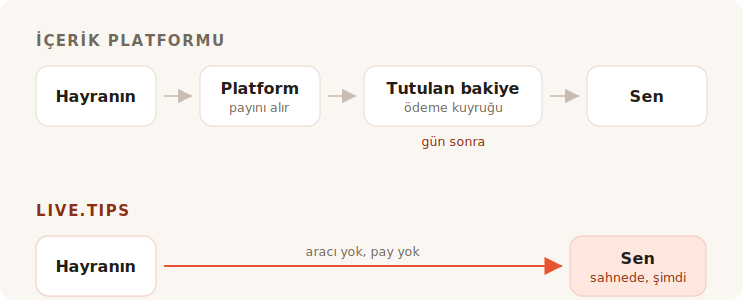

Seti bitiriyorsun. Salon gürültülü, barın yanında biri bir tane daha diye bağırıyor
ve yaklaşık sekiz saniye boyunca önündeki herkes sana para vermek istiyor. Sonra o
an kapanıyor. Arkadaşlarıyla konuşuyorlar, montlarını arıyorlar, çıkıp gidiyorlar.

O salonda kimsenin nakit parası yok. Sen de bir bahşiş kavanozu aramaya çıkıyorsun
ve bulduğun her sonuç senden sayfası olan bir içerik üreticisi olmanı istiyor.

## Bu araçlar aslında ne için

Ko-fi, Buy Me a Coffee ve Patreon, başka bir yerde ve daha sonra olan bir hayranın
etrafında kurulmuştur. Biri gönderini okudu, videonu izledi, çizgi romanını bitirdi
— ve haftalar sonra, telefonuyla yalnız başına, sana beş euro göndermeye karar
veriyor. O hayranın vakti var. Hesap açabilir. Kademelerini okuyabilir.

Bu ürünlerdeki her şey tek bir varsayımdan doğuyor. Üyelikler, mağaza, özel
gönderiler, galeri, Discord rolleri. İyi bir varsayım ve ona iyi hizmet ediyorlar.
Burada kıvırmıyoruz: bu projenin kendi «geliştiriciye bir kahve ısmarla» bağlantısı
Buy Me a Coffee'ye gidiyor ve o işi gayet iyi görüyor.

TipTopJar hedefe daha yakın — içerik üreticisi platformu değil, bir bahşiş ürünü ve
bir QR kodu basıyor. Ama o da sana bir kullanıcı adı ayırarak, kimliğini
doğrulayarak ve bir PayPal Business hesabı isteyerek başlıyor.

Bunların hiçbiri yanlış değil. Sadece bir sahne değil.

## Herkesin tartıştığı kısım komisyon

Ayrıca dürüst cevabın bizi pazarlamanın istediğinden daha az pohpohladığı kısım da
bu — o yüzden hakkını verelim.

**Ko-fi bir bahşişten 0% alır** ve onu doğrudan senin kendi Stripe veya PayPal
hesabına yatırır. Kendi sözleriyle: *«Ko-fi'de doğrudan ödeme alırsın, paranı asla
tutmayız.»* Üyelikleri veya mağazayı onların 5% kesintisi olmadan istiyorsan, o
Ko-fi Gold, ayda $12. Sadece bahşişlerde Ko-fi gerçekten ücretsiz ve her platformun
bahşişlerini tırtıkladığını söyleyen biri sana bir şey satıyordur.

**Buy Me a Coffee her şeyden 5% alır**, üstüne Stripe'ın kendi 2.9% + $0.30'ı ve bir
de 0.5% ödeme çıkış ücreti. Sonra paran, $10'a ulaşana kadar dokunamadığın bir
bakiyede oturur ve ilk ödeme, yardım merkezlerinin tipik olarak 7 ila 14 gün
sürdüğünü söylediği bir inceleme kuyruğundan geçer.

**TipTopJar** her bahşişten, hayranından bahşişinin üstüne kapatmasını istediği bir
ücret alır — Product Hunt kaydı buna sabit 5% diyor, gerçi bu sayı sitenin kendisinde
hiçbir yerde görünmüyor. Ücretsiz plan **tek seferlik $9.99 kurulum ücreti** taşır
ve 3 ila 5 iş gününde ödeme yapar; aynı gün ödemeler ayda $9.99'a mal olur.

Yani: biri bahşişlerde ücretsiz, biri işlemci işini bitirdikten sonra gecenin onda
birini alıyor ve biri de ilk hayranın daha hiçbir şey taramadan senden on dolar
alıyor.

## Yüzde sıfır, hiçbir şeyle aynı şey değil

İşte tüm komisyon tablolarının atladığı kısım, ve bir Ko-fi bahşişiyle bir
live.tips bahşişinin neden aynı boyutta olmadığının sebebi bu.

Bu ürünlerin her biri — Ko-fi dahil, ve Stripe üzerinde çalışırken live.tips de —
parayı bir kart işlemcisinden geçirir, ve bir kart işlemcisi her bir işlemden bir
yüzde ve sabit bir tutar alır. Ko-fi bu konuda dürüst; fiyatlandırma sayfaları
*«normal ödeme işlemcisi ücretleri de geçerlidir.»* yıldız işaretini taşıyor. Onların
0%'ı gerçek bir 0%. Stripe'ın bıraktığının 0%'ı.

Küçük bahşişleri sessizce mahveden işte o sabit tutar. Bir işlemcinin sabit ücreti
€2'lik bir bahşişte de €200'lük bir bahşişte de aynıdır, ve bahşişler doğası gereği
küçüktür. Kartla verilen bir bahşiş, atıldığından hep biraz daha hafif iner.

**Revolut veya MobilePay bahşişinde hiç işlemci yoktur.** Hayranın kendi Revolut'unu
açar ve `@username`'ine para gönderir; Revolut'tan Revolut'a transferler ücretsizdir
ve saniyeler içinde ulaşır. Ya da MobilePay'i açıp senin Box'ına öder, ki bu
Finlandiya'da €400 altındaki kişisel transferler için ücretsizdir — hiçbir sokak
müzisyeninin bahşişinin zorlamayacağı bir eşik. Birinin bir arkadaşına bira parasını
geri ödemesinde olanla aynı şey, çünkü kelimenin tam anlamıyla o: iki kişi arasında
kişisel bir transfer. Ne satıcı, ne acquirer, ne yüzde, ne otuz sent.

€5'lik bir bahşiş €5 olarak ulaşır. Hiçten alınan bir pay eksi, ve bir işlem ücreti
eksi, ve bir ödeme ücreti eksi €5 olarak değil. €5 olarak.

«Ücret yok»un anlaması gereken şey budur, ve bu iki ray üzerinde bunu yıldız işareti
olmadan söyleyebiliriz. Bir komisyon bölümünün varacağı tuhaf bir sonuç, o yüzden
sessiz kalınan kısmı söyleyelim: aldıkları pahalı şey hiçbir zaman para olmadı.

## Aslında aldıkları şey salonun kendisi

Çevrimiçi bir bahşiş sayfası özel bir işlemdir. Öyle olmak zorunda — hayran yalnızdır.

Sahnedeki bir bahşiş özel değildir, ve bütün mekanizma da budur. Yanındaki ekrandaki
kavanoz gözle görülür şekilde dolarken, hedef çubuğu ilerlerken, bir isim ve bir
mesaj ekrana düşerken ve sen onu mikrofona okuyup *teşekkürler, Mira* derken — salon
vermenin gerçekleştiğini görür. Bahşiş vermek bir iyilik olmaktan çıkıp salonun
birlikte yaptığı bir şeye dönüşür. Bu bir ödeme özelliği değil. Nakit kavanozun dört
yüz yıl işe yaramasının sebebi bu, ve herkes bozuk para taşımayı bırakınca ölen şey
de bu.

Ko-fi'nin yayın bildirimleri var, hem de iyileri — ama bunlar bir OBS katmanı, evde
Twitch karşısında oturan bir izleyiciye yönelik. Buy Me a Coffee'nin hiç canlı
yüzeyi yok. TipTopJar sana bir QR kodu basar ve gerçek zamanlı bir pano gösterir, ki
o *senin* için bir ekran, salon için değil.

Hiçbiri seyircinin önüne bir kavanoz koymayacak.

## Ekipmanı taşırken kurulum

İşte çevrimiçi bir platformun gerçekten düzeltemeyeceği diğer şey, çünkü bu, onun ne
olduğunun bir sonucu.

live.tips ile bir Revolut bahşişi almak için uygulamaya `@username`'ini yazarsın.
MobilePay almak için Box bağlantını yapıştırırsın. Bütün entegrasyon bu. Hesap yok,
kayıt yok, kimlik kontrolü yok, banka bilgisi yok, doğrulama e-postası beklemek yok
— saniyeler, ses provası sırasında, ayakta, zaten elindeki telefonda.

Ko-fi, Buy Me a Coffee ve TipTopJar bunu sunamaz, ve tembel oldukları için değil.
Bütün modelleri, ödemenin içinde oturmalarını ve gerçekleştiğini bilmelerini
gerektirir. İki kişinin birbirine yaptığı bir ödemenin içinde oturamazsın, o yüzden
bir platform sana hiçbir maliyeti olmayan rayları asla veremez. Seni maliyeti
olanların içinden geçirmek zorundadır.

Ve tam da burada sana karşı dürüst olmalıyız. **live.tips de bunun gerçekleştiğini
bilemez.** Revolut ve MobilePay'in bir ödemeyi onaylamanın hiçbir yolu yok, o yüzden
bu bahşişler sahne ekranında *doğrulanmamış* etiketiyle görünür: hayran formu
gönderdiği anda ortaya çıkarlar, ödemeyi tamamlasa da tamamlamasa da. Bunları kendi
bankacılık uygulamanla karşılaştırırsın. Ortada kimsenin durmamasının bedeli bu, ve
bunu gömmektense burada basmayı tercih ederiz.

Kartla verilen bahşişler doğrulanmış yoldur, ve Stripe üzerinden geçer. Bu, senin
adına bir Stripe hesabı demek — Stripe kendi kimlik kontrolünü yapar, tıpkı
düzenlenmiş her işlemcinin yapması gerektiği gibi. Ne demek olmadığı ise *bizde* bir
hesap: kısıtlı bir API anahtarı oluşturursun, yapıştırırsın ve uygulama
`api.stripe.com` ile konuşur, başka hiçbir yerle değil. Paranın bütün yolunu
[live.tips parayı nasıl yönetiyor](post:how-live-tips-handles-money) yazısında
anlattık.

## Her şey tek sayfada

| | live.tips | Ko-fi | Buy Me a Coffee | TipTopJar |
| --- | --- | --- | --- | --- |
| **Bahşişten kesinti** | yok | yok | 5% | ~5%, hayranın bahşişine eklenir |
| **İşlem ücreti** | Stripe'ın kendi ücreti — Revolut / MobilePay'de **hiç yok** | Stripe'ın / PayPal'ın, her zaman | Stripe'ın, + 0.5% ödeme | işlemcinin kendi ücreti |
| **Paranı kim tutar** | hiç kimse | hiç kimse | Buy Me a Coffee | TipTopJar |
| **Ne zaman alırsın** | bahşiş geçtiği anda | bahşiş geçtiği anda | $10'dan sonra, ilk ödeme 7–14 gün | 3–5 iş günü, ya da aynı gün için $9.99/ay |
| **Başlama maliyeti** | ücretsiz | ücretsiz | ücretsiz | $9.99 kurulum ücreti |
| **Araçta hesap** | yok | gerekli | gerekli | gerekli, üstüne kimlik kontrolü |
| **Seyircinin görebileceği kavanoz** | evet | hayır | hayır | hayır |
| **Revolut / MobilePay** | evet | hayır | hayır | hayır |
| **Açık kaynak** | MIT | hayır | hayır | hayır |

Ücretler ve ödeme koşulları, Temmuz 2026'da her hizmetin kendi sayfalarında yayımlandığı haliyle; TipTopJar'ın yüzdesi hariç, ki o yalnızca Product Hunt kaydında görünüyor. Revolut'tan Revolut'a transferler Revolut'a göre ücretsiz; MobilePay'in Finlandiya'daki kişisel transferleri €400 altında ücretsiz, üstünde 1% alıyor. Fiyatlar değişir; bir rakibin sözüne güvenmek yerine git kendin kontrol et.
{: .footnote }

## live.tips'i ne zaman kullanmamalısın

Yinelenen üyelikler, baskıların için bir mağaza, özel gönderiler ve hayranların seni
gösteriler arasında bulabileceği bir yer istiyorsan, o zaman Ko-fi istiyorsun, ve
git Ko-fi kullan. Bunun bizim asla yapabileceğimizden daha iyi bir versiyonu, ve
bahşişlerde sana hiçbir maliyeti yok.

live.tips bir platform değil ve olmaya da çalışmıyor. Bakımını yapacağın bir sayfa
yok, ayıracağın bir kullanıcı adı yok, ihlal edeceğin bir hizmet şartları yok, bir
gösteriden önce gece on birde alacağın bir askıya alma e-postası yok. Askıya alınacak
bir şey yok. Uygulama tarayıcında çalışır, anahtar cihazının anahtar zincirinde
yaşar, her şey GitHub'da MIT lisanslıdır, ve yarın yok olsak gitar kutuna
yapıştırılmış QR kodu çalışmaya devam ederdi, çünkü bize değil, [kendi Stripe
bağlantına](post:one-qr-code-every-payment-method) işaret ediyor.

Bu, niyetlerimiz hakkında bir söz değil. Ne inşa ettiğimizin bir tarifi, ve gidip
okuyabilirsin.

## Güvenmeden önce dene

[Uygulamayı](/app/?lang=tr) aç, Stripe'ı demo modunda bırak ve kavanoza bir demo
bahşiş at. Bir dakika sürer, hiçbir şeye mal olmaz ve bunu yapmak için bize adını
söylemek zorunda değilsin.

Sonra bir sonraki gösterinde onu bir sehpaya koy ve kavanozun dolduğunu görebildiğinde
salonun ne yaptığını izle.
